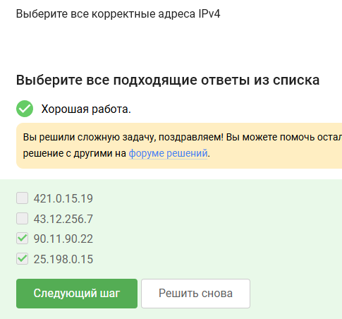
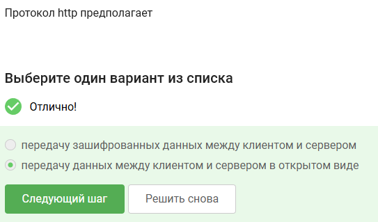
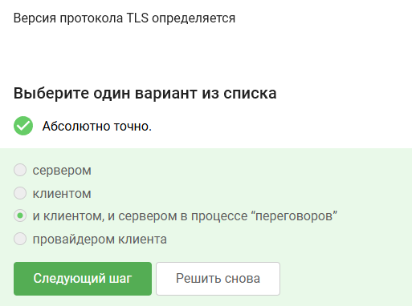
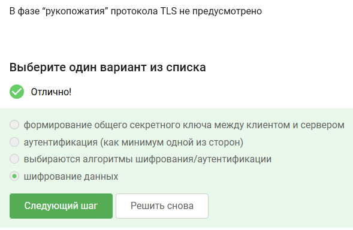
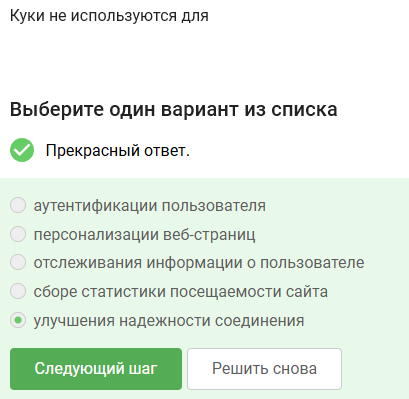
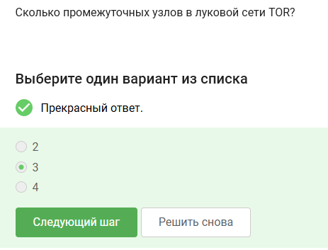
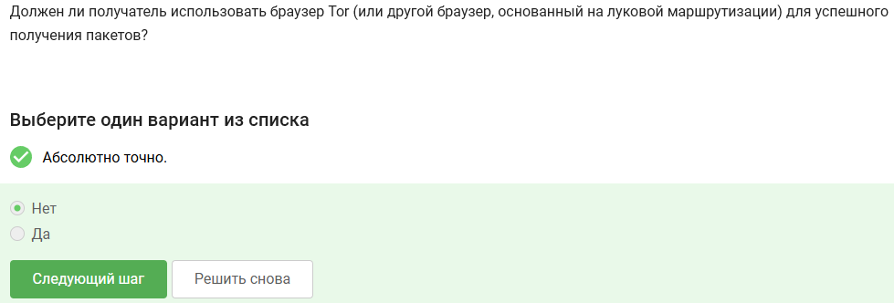
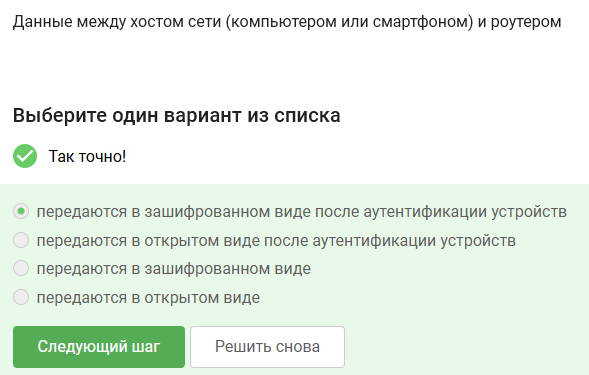

---
## Author
author:
  name: Артём Дмитриевич Петлин
  degrees: Student
  orcid: 0000-0002-0877-7063
  email: 1132246846@pfur.ru
  affiliation:
    - name: Российский университет дружбы народов
      country: Российская Федерация
      postal-code: 117198
      city: Москва
      address: ул. Миклухо-Маклая, д. 6
## Title
title: Внешний курс основы кибербезопасности. Раздел 1
license: CC BY
date: today	
date-format: "YYYY-MM-DD" # Example: 2025-09-06
---

# Информация

## Докладчик

:::::::::::::: {.columns align=center}
::: {.column width="70%"}

  * Петлин Артём Дмитриевич
  * студент
  * группа НПИбд-02-24
  * Российский университет дружбы народов
  * [1132246846@pfur.ru](mailto:1132246846@pfur.ru)
  * <https://github.com/hikrim/study_2025-2026_infosec-intro>

:::
::: {.column width="30%"}

:::
::::::::::::::

# Цель работы

## Цель работы

Выполнить первый раздел внешнего курса "Основы кибербезопасности".

# Задание

## Задание

Первый раздел курса "Основы кибербезопасности".

# Теоретическое введение

## Теоретическое введение

Теоретическое введение в курсе представлено в виде видео-лекций.

# Выполнение лабораторной работы

## Ход работы

:::::::::::::: {.columns align=center}
::: {.column width="50%"}

HTTPS - протокол прикладного уровня

:::
::: {.column width="50%"}

{#fig-001 width=100%}

:::
::::::::::::::

## Ход работы

:::::::::::::: {.columns align=center}
::: {.column width="50%"}

Протокол TCP работает на траснпортном уровне

:::
::: {.column width="50%"}

{#fig-002 width=100%}

:::
::::::::::::::

## Ход работы

:::::::::::::: {.columns align=center}
::: {.column width="50%"}

В остальных есть значения больше 255, что неправильно

:::
::: {.column width="50%"}

{#fig-003 width=100%}

:::
::::::::::::::

## Ход работы

:::::::::::::: {.columns align=center}
::: {.column width="50%"}

DNS сервер сопопставляет IP адреса доменным именам. Остальное не подходит

:::
::: {.column width="50%"}

{#fig-004 width=100%}

:::
::::::::::::::

## Ход работы

:::::::::::::: {.columns align=center}
::: {.column width="50%"}

Корректная поледовательность протоколов в модели TCP/IP: прикладной -- транспортный -- сетевой -- канальный

:::
::: {.column width="50%"}

{#fig-005 width=100%}

:::
::::::::::::::

## Ход работы

:::::::::::::: {.columns align=center}
::: {.column width="50%"}

Протокол http предпологает передачу данных между клиентом и сервером в открытом виде

:::
::: {.column width="50%"}

{#fig-006 width=100%}

:::
::::::::::::::

## Ход работы

:::::::::::::: {.columns align=center}
::: {.column width="50%"}

HTTP состоит из двух фаз: рукопожатия и передачи данных

:::
::: {.column width="50%"}

{#fig-007 width=100%}

:::
::::::::::::::

## Ход работы

:::::::::::::: {.columns align=center}
::: {.column width="50%"}

Версия протокола TLS определяется как клиентом, так и сервером в процессе "переговоров"

:::
::: {.column width="50%"}

{#fig-008 width=100%}

:::
::::::::::::::

## Ход работы

:::::::::::::: {.columns align=center}
::: {.column width="50%"}

В фазе рукопожатия TLS не предусмотрено шифрование данных

:::
::: {.column width="50%"}

{#fig-009 width=100%}

:::
::::::::::::::

## Ход работы

:::::::::::::: {.columns align=center}
::: {.column width="50%"}

Куки хранят id сессии и идентификатор пользователя

:::
::: {.column width="50%"}

{#fig-010 width=100%}

:::
::::::::::::::

## Ход работы

:::::::::::::: {.columns align=center}
::: {.column width="50%"}

Куки не используются для улучшения надежности соединения

:::
::: {.column width="50%"}

{#fig-011 width=100%}

:::
::::::::::::::

## Ход работы

:::::::::::::: {.columns align=center}
::: {.column width="50%"}

Куки генерируются сервером

:::
::: {.column width="50%"}

{#fig-012 width=100%}

:::
::::::::::::::

## Ход работы

:::::::::::::: {.columns align=center}
::: {.column width="50%"}

Сессионные куки хранятся в браузере на время пользования веб-сайтом

:::
::: {.column width="50%"}

{#fig-013 width=100%}

:::
::::::::::::::

## Ход работы

:::::::::::::: {.columns align=center}
::: {.column width="50%"}

В луковой сети TOR 3 промежуточных узла

:::
::: {.column width="50%"}

{#fig-014 width=100%}

:::
::::::::::::::

## Ход работы 

:::::::::::::: {.columns align=center}
::: {.column width="50%"}

Остальные варианты не подходят

:::
::: {.column width="50%"}

{#fig-015 width=100%}

:::
::::::::::::::

## Ход работы 

:::::::::::::: {.columns align=center}
::: {.column width="50%"}

Отправитель генерирует общий секретный ключ с охранным, промежуточным и выходном узлом

:::
::: {.column width="50%"}

{#fig-016 width=100%}

:::
::::::::::::::

## Ход работы

:::::::::::::: {.columns align=center}
::: {.column width="50%"}

Нет, получатель не должен использовать браузер TOR для получения пакетов

:::
::: {.column width="50%"}

{#fig-017 width=100%}

:::
::::::::::::::

## Ход работы

:::::::::::::: {.columns align=center}
::: {.column width="50%"}

WiFI - это технология беспроводной локальной сети (IEEE 802.11)

:::
::: {.column width="50%"}

{#fig-018 width=100%}

:::
::::::::::::::

## Ход работы

:::::::::::::: {.columns align=center}
::: {.column width="50%"}

WiFi работает на канальном уровне

:::
::: {.column width="50%"}

{#fig-019 width=100%}

:::
::::::::::::::

## Ход работы

:::::::::::::: {.columns align=center}
::: {.column width="50%"}

WEP - небезопасный метод обеспечения шифрования и аутентификации в сети WiFi

:::
::: {.column width="50%"}

{#fig-020 width=100%}

:::
::::::::::::::

## Ход работы

:::::::::::::: {.columns align=center}
::: {.column width="50%"}

Данные между хостом сети и роутером передаются в зашифрованном виде после аутентификации устройств

:::
::: {.column width="50%"}

{#fig-021 width=100%}

:::
::::::::::::::

## Ход работы

:::::::::::::: {.columns align=center}
::: {.column width="50%"}

Personal - персональный, enterprise - для компаний

:::
::: {.column width="50%"}

{#fig-022 width=100%}

:::
::::::::::::::

# Выводы

## Выводы

Мы выполнили первый раздел курса "Основы кибербезопасности".

# Список литературы{.unnumbered}

## Список литературы{.unnumbered}

::: {#refs}
:::
