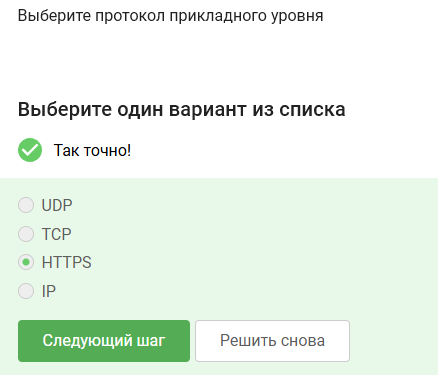
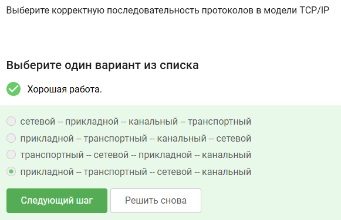
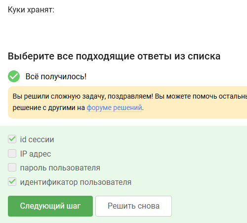
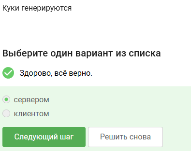
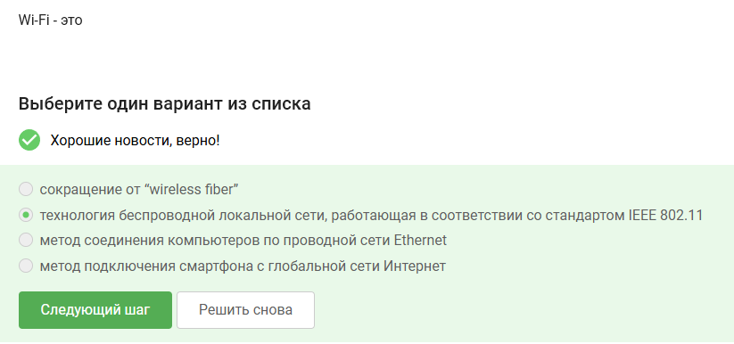
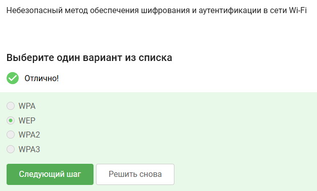
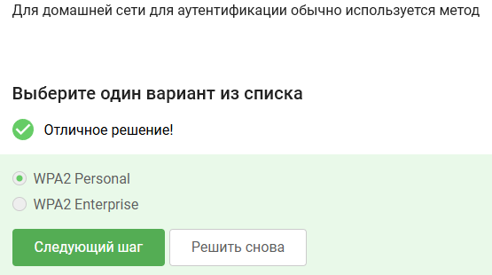

---
## Author
author:
  name: Артём Дмитриевич Петлин
  degrees: student
  orcid: 0000-0002-0877-7063
  email: kulyabov-ds@rudn.ru
  affiliation:
    - name: Российский университет дружбы народов
      country: Российская Федерация
      postal-code: 117198
      city: Москва
      address: ул. Миклухо-Маклая, д. 6

## Title
title: "Внешний курс основы кибербезопасности. Раздел 1"
license: "CC BY"
---

# Цель работы

Выполнить первый раздел внешнего курса "Основы кибербезопасности".

# Задание

Первый раздел курса "Основы кибербезопасности".

# Теоретическое введение

Теоретическое введение в курсе представлено в виде видео-лекций.

# Выполнение лабораторной работы

{#fig-001 width=100%}

HTTPS - протокол прикладного уровня

{#fig-002 width=100%}

Протокол TCP работает на траснпортном уровне

{#fig-003 width=100%}

В остальных есть значения больше 255, что неправильно

{#fig-004 width=100%}

DNS сервер сопопставляет IP адреса доменным именам. Остальное не подходит

{#fig-005 width=100%}

Корректная поледовательность протоколов в модели TCP/IP: прикладной -- транспортный -- сетевой -- канальный

{#fig-006 width=100%}

Протокол http предпологает передачу данных между клиентом и сервером в открытом виде

{#fig-007 width=100%}

HTTP состоит из двух фаз: рукопожатия и передачи данных

{#fig-008 width=100%}

Версия протокола TLS определяется как клиентом, так и сервером в процессе "переговоров"

{#fig-009 width=100%}

В фазе рукопожатия TLS не предусмотрено шифрование данных

{#fig-010 width=100%}

Куки хранят id сессии и идентификатор пользователя

{#fig-011 width=100%}

Куки не используются для улучшения надежности соединения

{#fig-012 width=100%}

Куки генерируются сервером

{#fig-013 width=100%}

Сессионные куки хранятся в браузере на время пользования веб-сайтом

{#fig-014 width=100%}

В луковой сети TOR 3 промежуточных узла

{#fig-015 width=100%}

Остальные варианты не подходят

{#fig-016 width=100%}

Отправитель генерирует общий секретный ключ с охранным, промежуточным и выходном узлом

{#fig-017 width=100%}

Нет, получатель не должен использовать браузер TOR для получения пакетов

{#fig-018 width=100%}

WiFI - это технология беспроводной локальной сети (IEEE 802.11)

{#fig-019 width=100%}

WiFi работает на канальном уровне

{#fig-020 width=100%}

WEP - небезопасный метод обеспечения шифрования и аутентификации в сети WiFi

{#fig-021 width=100%}

Данные между хостом сети и роутером передаются в зашифрованном виде после аутентификации устройств

{#fig-022 width=100%}

Personal - персональный, enterprise - для компаний

# Выводы

Мы выполнили первый раздел курса "Основы кибербезопасности".

# Список литературы{.unnumbered}

::: {#refs}
:::
