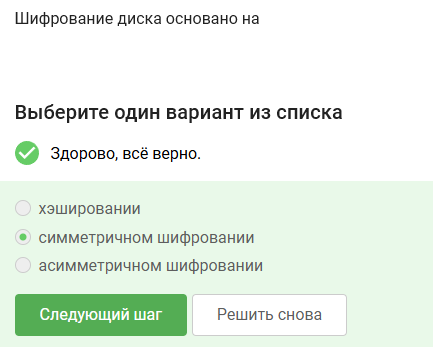
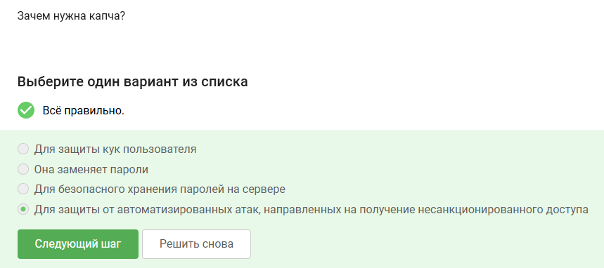
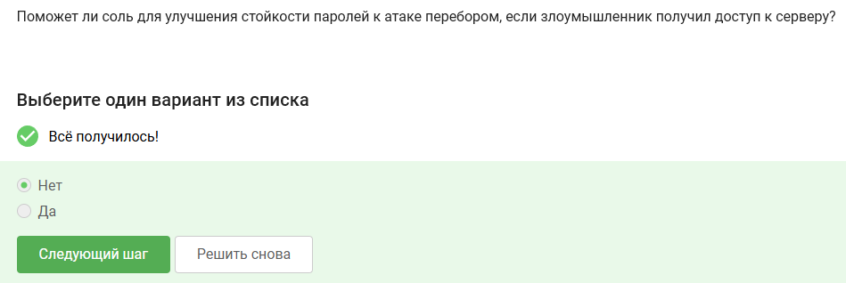
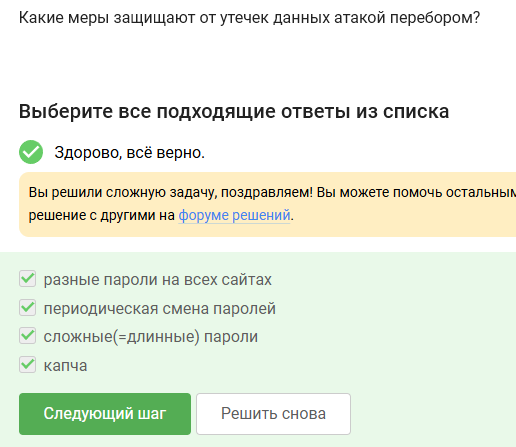
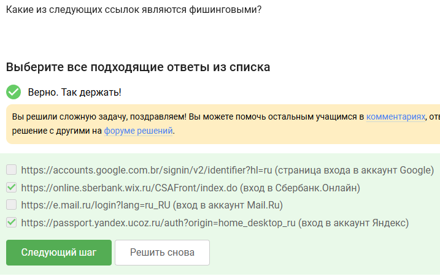

---
## Author
author:
  name: Артём Дмитриевич Петлин
  degrees: Student
  orcid: 0000-0002-0877-7063
  email: 1132246846@pfur.ru
  affiliation:
    - name: Российский университет дружбы народов
      country: Российская Федерация
      postal-code: 117198
      city: Москва
      address: ул. Миклухо-Маклая, д. 6
## Title
title: Внешний курс основы кибербезопасности. Раздел 2
license: CC BY
date: today	
date-format: "YYYY-MM-DD" # Example: 2025-09-06
---

# Информация

## Докладчик

:::::::::::::: {.columns align=center}
::: {.column width="70%"}

  * Петлин Артём Дмитриевич
  * студент
  * группа НПИбд-02-24
  * Российский университет дружбы народов
  * [1132246846@pfur.ru](mailto:1132246846@pfur.ru)
  * <https://github.com/hikrim/study_2025-2026_infosec-intro>

:::
::: {.column width="30%"}

:::
::::::::::::::

# Цель работы

## Цель работы

Выполнить второй раздел внешнего курса "Основы кибербезопасности".

# Задание

## Задание

Второй раздел курса "Основы кибербезопасности".

# Теоретическое введение

## Теоретическое введение

Теоретическое введение в курсе представлено в виде видео-лекций.

# Выполнение лабораторной работы

## Ход работы

:::::::::::::: {.columns align=center}
::: {.column width="50%"}

Загрузочный сектор диска можно зашифровать

:::
::: {.column width="50%"}

{#fig-001 width=100%}

:::
::::::::::::::

## Ход работы

:::::::::::::: {.columns align=center}
::: {.column width="50%"}

Шифрование диска основано на симметричном шифровании

:::
::: {.column width="50%"}

{#fig-002 width=100%}

:::
::::::::::::::

## Ход работы

:::::::::::::: {.columns align=center}
::: {.column width="50%"}

Жесткий диск можно зашифровать с помощью программ VeraCrypt и BitLocker

:::
::: {.column width="50%"}

{#fig-003 width=100%}

:::
::::::::::::::

## Ход работы

:::::::::::::: {.columns align=center}
::: {.column width="50%"}

Остальный пароли простые, даже не используют спецсимволы и разные регистры

:::
::: {.column width="50%"}

{#fig-004 width=100%}

:::
::::::::::::::

## Ход работы

:::::::::::::: {.columns align=center}
::: {.column width="50%"}

Пароли безопасно хранить только в менеджерах паролей

:::
::: {.column width="50%"}

{#fig-005 width=100%}

:::
::::::::::::::

## Ход работы

:::::::::::::: {.columns align=center}
::: {.column width="50%"}

Капча нужна для защиты от автоматизированных атак

:::
::: {.column width="50%"}

{#fig-006 width=100%}

:::
::::::::::::::

## Ход работы

:::::::::::::: {.columns align=center}
::: {.column width="50%"}

Хэширование паролей применяется для того, чтобы не хранить пароли на сервере в открытом виде, то есть для безопасности

:::
::: {.column width="50%"}

{#fig-007 width=100%}

:::
::::::::::::::

## Ход работы

:::::::::::::: {.columns align=center}
::: {.column width="50%"}

Соль не поможет для улучшения стойкости паролей к атаке перебором

:::
::: {.column width="50%"}

{#fig-008 width=100%}

:::
::::::::::::::

## Ход работы

:::::::::::::: {.columns align=center}
::: {.column width="50%"}

Все предложенные меры защищают от утечек данных атакой перебором

:::
::: {.column width="50%"}

{#fig-009 width=100%}

:::
::::::::::::::

## Ход работы

:::::::::::::: {.columns align=center}
::: {.column width="50%"}

Правильные: sberbank.ru, yandex.ru, без чего-то дополнительного между

:::
::: {.column width="50%"}

{#fig-010 width=100%}

:::
::::::::::::::

## Ход работы

:::::::::::::: {.columns align=center}
::: {.column width="50%"}

Да, может быть подмена адресса

:::
::: {.column width="50%"}

{#fig-011 width=100%}

:::
::::::::::::::

## Ход работы

:::::::::::::: {.columns align=center}
::: {.column width="50%"}

Email Спуфинг - это подмена адреса отправителя в имейлах

:::
::: {.column width="50%"}

{#fig-012 width=100%}

:::
::::::::::::::

## Ход работы

:::::::::::::: {.columns align=center}
::: {.column width="50%"}

Вирус троян маскируется под легитимную программу

:::
::: {.column width="50%"}

{#fig-013 width=100%}

:::
::::::::::::::

## Ход работы

:::::::::::::: {.columns align=center}
::: {.column width="50%"}

Формируется при генерации первого сообщения стороной-отправителем

:::
::: {.column width="50%"}

{#fig-014 width=100%}

:::
::::::::::::::

## Ход работы

:::::::::::::: {.columns align=center}
::: {.column width="50%"}

Суть сквозного шифрования состоит в том, что сообщения передаются по узлам связи в зашифрованном виде

:::
::: {.column width="50%"}

{#fig-015 width=100%}

:::
::::::::::::::

# Выводы

## Выводы

Мы выполнили второй раздел внешнео курса "Основы кибербезопасности", изучили что такое фишинг, Email Спуфинг и другое.

# Список литературы{.unnumbered}

## Список литературы{.unnumbered}

::: {#refs}
:::
