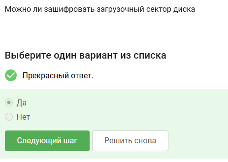
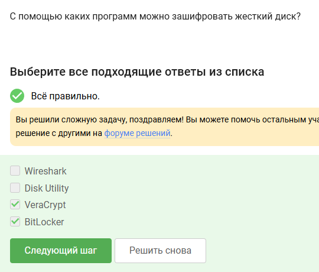
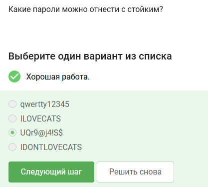
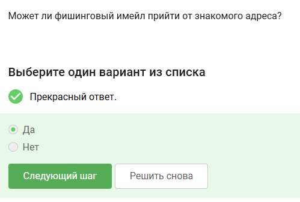

---
## Author
author:
  name: Артём Дмитриевич Петлин
  degrees: student
  orcid: 0000-0002-0877-7063
  email: kulyabov-ds@rudn.ru
  affiliation:
    - name: Российский университет дружбы народов
      country: Российская Федерация
      postal-code: 117198
      city: Москва
      address: ул. Миклухо-Маклая, д. 6

## Title
title: "Внешний курс основы кибербезопасности. Раздел 2"
license: "CC BY"
---

# Цель работы

Выполнить второй раздел внешнего курса "Основы кибербезопасности".

# Задание

Второй раздел курса "Основы кибербезопасности".

# Теоретическое введение

Теоретическое введение в курсе представлено в виде видео-лекций.

# Выполнение лабораторной работы

{#fig-001 width=100%}

Загрузочный сектор диска можно зашифровать

{#fig-002 width=100%}

Шифрование диска основано на симметричном шифровании

{#fig-003 width=100%}

Жесткий диск можно зашифровать с помощью программ VeraCrypt и BitLocker

{#fig-004 width=100%}

Остальный пароли простые, даже не используют спецсимволы и разные регистры

{#fig-005 width=100%}

Пароли безопасно хранить только в менеджерах паролей

{#fig-006 width=100%}

Капча нужна для защиты от автоматизированных атак

{#fig-007 width=100%}

Хэширование паролей применяется для того, чтобы не хранить пароли на сервере в открытом виде, то есть для безопасности

{#fig-008 width=100%}

Соль не поможет для улучшения стойкости паролей к атаке перебором

{#fig-009 width=100%}

Все предложенные меры защищают от утечек данных атакой перебором

{#fig-010 width=100%}

Правильные: sberbank.ru, yandex.ru, без чего-то дополнительного между

{#fig-011 width=100%}

Да, может быть подмена адресса

{#fig-012 width=100%}

Email Спуфинг - это подмена адреса отправителя в имейлах

{#fig-013 width=100%}

Вирус троян маскируется под легитимную программу

{#fig-014 width=100%}

Формируется при генерации первого сообщения стороной-отправителем

{#fig-015 width=100%}

Суть сквозного шифрования состоит в том, что сообщения передаются по узлам связи в зашифрованном виде

# Выводы

Мы выполнили второй раздел внешнео курса "Основы кибербезопасности", изучили что такое фишинг, Email Спуфинг и другое.

# Список литературы{.unnumbered}

::: {#refs}
:::
