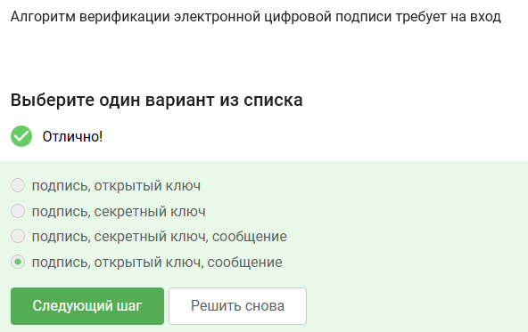
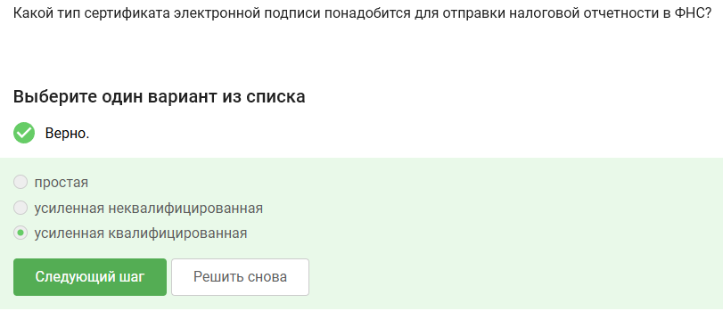
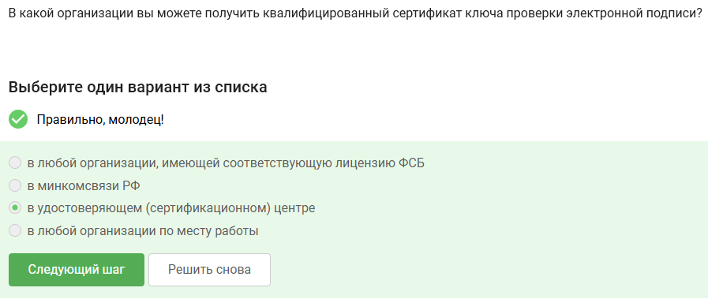
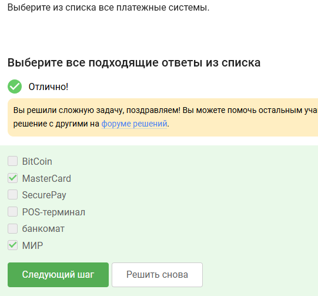
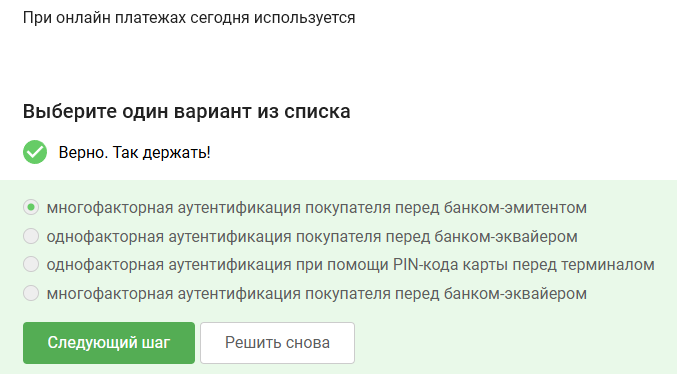
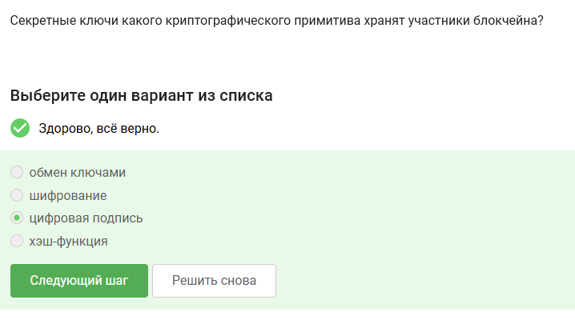

---
## Author
author:
  name: Артём Дмитриевич Петлин
  degrees: Student
  orcid: 0000-0002-0877-7063
  email: 1132246846@pfur.ru
  affiliation:
    - name: Российский университет дружбы народов
      country: Российская Федерация
      postal-code: 117198
      city: Москва
      address: ул. Миклухо-Маклая, д. 6
## Title
title: Внешний курс основы кибербезопасности. Раздел 3
license: CC BY
date: today	
date-format: "YYYY-MM-DD" # Example: 2025-09-06
---

# Информация

## Докладчик

:::::::::::::: {.columns align=center}
::: {.column width="70%"}

  * Петлин Артём Дмитриевич
  * студент
  * группа НПИбд-02-24
  * Российский университет дружбы народов
  * [1132246846@pfur.ru](mailto:1132246846@pfur.ru)
  * <https://github.com/hikrim/study_2025-2026_infosec-intro>

:::
::: {.column width="30%"}

:::
::::::::::::::

# Цель работы

## Цель работы

Выполнить третий раздел внешнего курса "Основы кибербезопасности".

# Задание

## Задание

Третий раздел курса "Основы кибербезопасности".

# Теоретическое введение

## Теоретическое введение

Теоретическое введение в курсе представлено в виде видео-лекций.

# Выполнение лабораторной работы

## Ход работы

:::::::::::::: {.columns align=center}
::: {.column width="50%"}

В ассиметрических криптографических примитивах обе стороны имеют пару ключей

:::
::: {.column width="50%"}

{#fig-001 width=100%}

:::
::::::::::::::

## Ход работы

:::::::::::::: {.columns align=center}
::: {.column width="50%"}

Криптографическая хэш-функция не обеспечивает конфидециальность захэшированных данных, а остальные варианты ответа подходят

:::
::: {.column width="50%"}

{#fig-002 width=100%}

:::
::::::::::::::

## Ход работы

:::::::::::::: {.columns align=center}
::: {.column width="50%"}

К алгоритмам цифровой подписи относятся RSA, ECDSA и ГОСТ Р 34.10-2012

:::
::: {.column width="50%"}

{#fig-003 width=100%}

:::
::::::::::::::

## Ход работы

:::::::::::::: {.columns align=center}
::: {.column width="50%"}

Обмен ключами Диффи-Хэллмана - это ассимитричный примитив генерации общего секретного ключа

:::
::: {.column width="50%"}

{#fig-004 width=100%}

:::
::::::::::::::

## Ход работы

:::::::::::::: {.columns align=center}
::: {.column width="50%"}

Алгоритм верификации электронной цифровой подписи требует на вход подпись, секретный ключ, сообщение

:::
::: {.column width="50%"}

{#fig-005 width=100%}

:::
::::::::::::::

## Ход работы

:::::::::::::: {.columns align=center}
::: {.column width="50%"}

Электронная цифровая подпись не обеспечивает конфиденциальность

:::
::: {.column width="50%"}

{#fig-006 width=100%}

:::
::::::::::::::

## Ход работы

:::::::::::::: {.columns align=center}
::: {.column width="50%"}

Для отправки налоговой отчетности в ФНС понадобится усиленная квалифицированная электронная подпись

:::
::: {.column width="50%"}

{#fig-007 width=100%}

:::
::::::::::::::

## Ход работы

:::::::::::::: {.columns align=center}
::: {.column width="50%"}

В сертификационном центре можно получить квалифицированный сертификат ключа проверки электронной подписи

:::
::: {.column width="50%"}

{#fig-008 width=100%}

:::
::::::::::::::

## Ход работы

:::::::::::::: {.columns align=center}
::: {.column width="50%"}

Платежными системами являются MasterCard и МИР

:::
::: {.column width="50%"}

{#fig-009 width=100%}

:::
::::::::::::::

## Ход работы

:::::::::::::: {.columns align=center}
::: {.column width="50%"}

Проверка пароля + код в СМС и код в СМС + отпечаток пальца - два примера многофакторной аутентификации

:::
::: {.column width="50%"}

{#fig-010 width=100%}

:::
::::::::::::::

## Ход работы

:::::::::::::: {.columns align=center}
::: {.column width="50%"}

Сегодня используется многофакторная аутентификация покупателя перед банком-эмитентом при онлайн платежах

:::
::: {.column width="50%"}

{#fig-011 width=100%}

:::
::::::::::::::

## Ход работы

:::::::::::::: {.columns align=center}
::: {.column width="50%"}

Верное свойство - сложность нахождения прообраза

:::
::: {.column width="50%"}

{#fig-012 width=100%}

:::
::::::::::::::

## Ход работы

:::::::::::::: {.columns align=center}
::: {.column width="50%"}

Консенсус в некоторых системах блокчейн обладает всеми предложенными в задании свойствами

:::
::: {.column width="50%"}

{#fig-013 width=100%}

:::
::::::::::::::

## Ход работы

:::::::::::::: {.columns align=center}
::: {.column width="50%"}

Участники блокчейна хранят секретные ключи цифровой подписи

:::
::: {.column width="50%"}

{#fig-014 width=100%}

:::
::::::::::::::

# Выводы

## Выводы

Мы выполнили третий раздел внешнего курса "Основы кибербезопасности", узнали больше про секретные ключи, цифровые подписи и блокчейн.

# Список литературы{.unnumbered}

## Список литературы{.unnumbered}

::: {#refs}
:::
