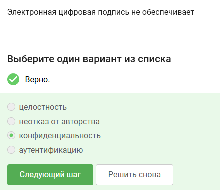
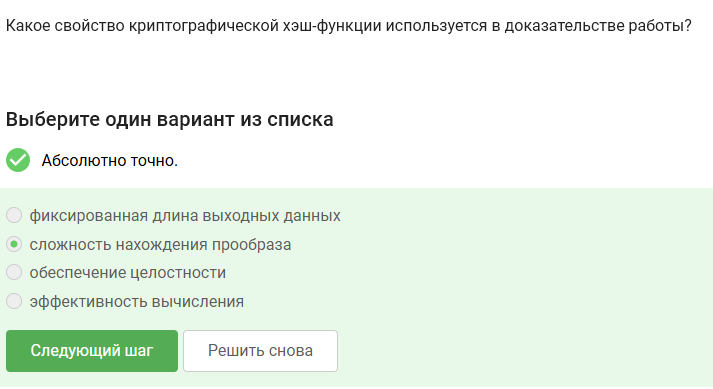

---
## Author
author:
  name: Артём Дмитриевич Петлин
  degrees: student
  orcid: 0000-0002-0877-7063
  email: kulyabov-ds@rudn.ru
  affiliation:
    - name: Российский университет дружбы народов
      country: Российская Федерация
      postal-code: 117198
      city: Москва
      address: ул. Миклухо-Маклая, д. 6

## Title
title: "Внешний курс основы кибербезопасности. Раздел 2"
license: "CC BY"
---

# Цель работы

Выполнить третий раздел внешнего курса "Основы кибербезопасности".

# Задание

Третий раздел курса "Основы кибербезопасности".

# Теоретическое введение

Теоретическое введение в курсе представлено в виде видео-лекций.

# Выполнение лабораторной работы

{#fig-001 width=100%}

В ассиметрических криптографических примитивах обе стороны имеют пару ключей

{#fig-002 width=100%}

Криптографическая хэш-функция не обеспечивает конфидециальность захэшированных данных, а остальные варианты ответа подходят

{#fig-003 width=100%}

К алгоритмам цифровой подписи относятся RSA, ECDSA и ГОСТ Р 34.10-2012

{#fig-004 width=100%}

Обмен ключами Диффи-Хэллмана - это ассимитричный примитив генерации общего секретного ключа

{#fig-005 width=100%}

Алгоритм верификации электронной цифровой подписи требует на вход подпись, секретный ключ, сообщение

{#fig-006 width=100%}

Электронная цифровая подпись не обеспечивает конфиденциальность

{#fig-007 width=100%}

Для отправки налоговой отчетности в ФНС понадобится усиленная квалифицированная электронная подпись

{#fig-008 width=100%}

В сертификационном центре можно получить квалифицированный сертификат ключа проверки электронной подписи

{#fig-009 width=100%}

Платежными системами являются MasterCard и МИР

{#fig-010 width=100%}

Проверка пароля + код в СМС и код в СМС + отпечаток пальца - два примера многофакторной аутентификации

{#fig-011 width=100%}

Сегодня используется многофакторная аутентификация покупателя перед банком-эмитентом при онлайн платежах

{#fig-012 width=100%}

Верное свойство - сложность нахождения прообраза

{#fig-013 width=100%}

Консенсус в некоторых системах блокчейн обладает всеми предложенными в задании свойствами

{#fig-014 width=100%}

Участники блокчейна хранят секретные ключи цифровой подписи

# Выводы

Мы выполнили третий раздел внешнего курса "Основы кибербезопасности", узнали больше про секретные ключи, цифровые подписи и блокчейн.

# Список литературы{.unnumbered}

::: {#refs}
:::
