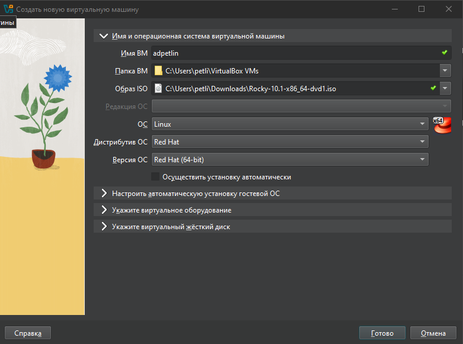
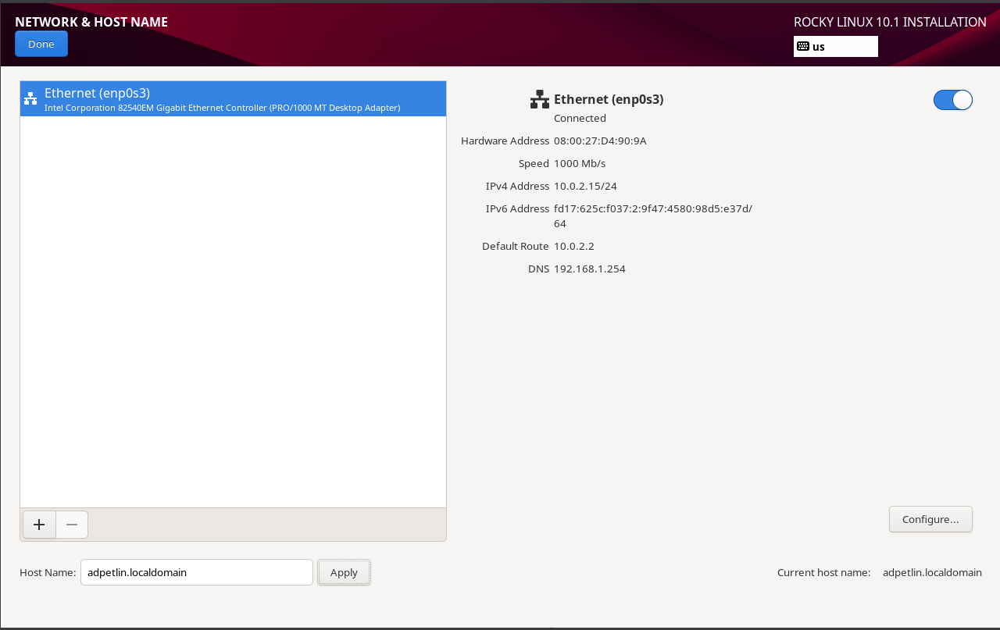
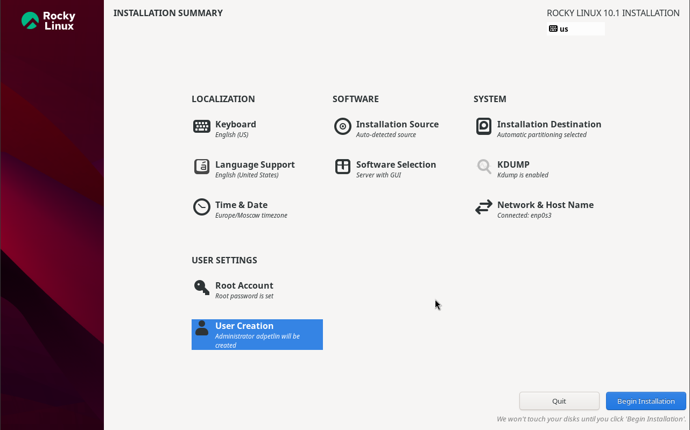
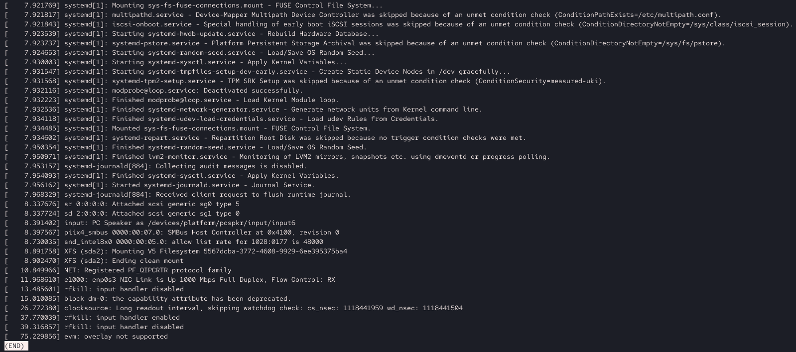
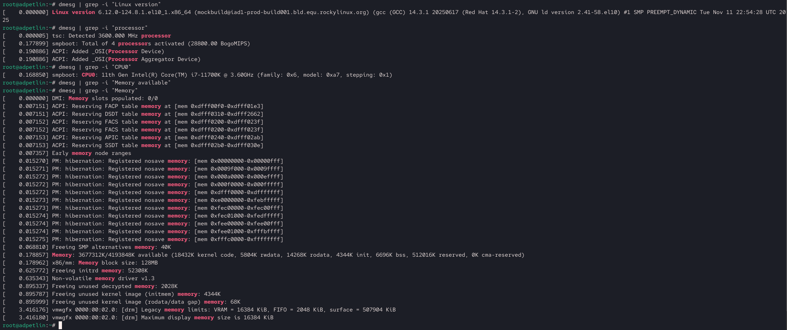
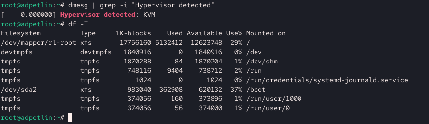
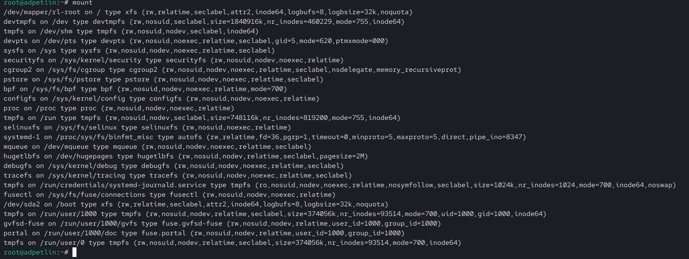

---
## Author
author:
  name: Артём Дмитриевич Петлин
  degrees: student
  orcid: 0000-0002-0877-7063
  email: kulyabov-ds@rudn.ru
  affiliation:
    - name: Российский университет дружбы народов
      country: Российская Федерация
      postal-code: 117198
      city: Москва
      address: ул. Миклухо-Маклая, д. 6

## Title
title: "Лабораторная работа №1"
license: "CC BY"
---

# Цель работы

Целью данной работы является приобретение практических навыков
установки операционной системы на виртуальную машину, настройки минимально необходимых для дальнейшей работы сервисов.

# Задание

1. Установить дистрибутив Rocky linux  
2. Проанализировать последоваетльность заргрузки ОС.
3. Версия ядра Linux (Linux version).
4. Частота процессора (Detected Mhz processor).
5. Модель процессора (CPU0).
6. Объем доступной оперативной памяти (Memory available).
7. Тип обнаруженного гипервизора (Hypervisor detected).
8. Тип файловой системы корневого раздела.
9. Последовательность монтирования файловых систем.

# Теоретическое введение

При выполнении работ следует придерживаться следующих правил именования: имя виртуальной машины, имя хоста вашей виртуальной машины,
пользователь внутри виртуальной машины должны совпадать с логином
студента, выполняющего лабораторную работу. Вы можете посмотреть
ваш логин, набрав в терминале ОС типа Linux команду id -un.

# Выполнение лабораторной работы

{#fig-001 width=100%}

Создаем и настраиваем дистрибутив в Virtual Box, соответствуя соглашении об именовании.

{#fig-002 width=100%}

Задаем имя узла по заданию.

{#fig-003 width=100%}

Конечные настройки для установшика, после чего устанавливаем систему и перезагружаемся.

{#fig-004 width=100%}

Анализировать последоваетльность заргрузки ОС.

{#fig-005 width=100%}

Находим следующую информацию: Версия ядра Linux (Linux version). Частота процессора (Detected Mhz processor). Модель процессора (CPU0). Объем доступной оперативной памяти (Memory available).

{#fig-006 width=100%}

Находим следующую информацию: Тип обнаруженного гипервизора (Hypervisor detected). Тип файловой системы корневого раздела.

{#fig-007 width=100%}

Узнаем последовательность монтирования файловых систем.

# Выводы

Мы приобрели практические навыки установки операционной системы на виртуальную машину, настройки минимально необходимых для дальнейшей работы сервисов.

# Список литературы{.unnumbered}

::: {#refs}
:::
