---
## Author
author:
  name: Артём Дмитриевич Петлин
  degrees: student
  orcid: 0000-0002-0877-7063
  email: kulyabov-ds@rudn.ru
  affiliation:
    - name: Российский университет дружбы народов
      country: Российская Федерация
      postal-code: 117198
      city: Москва
      address: ул. Миклухо-Маклая, д. 6

## Title
title: "Лабораторная работа №2"
license: "CC BY"
---

# Цель работы

Получение практических навыков работы в консоли с атрибутами файлов, закрепление теоретических основ дискреционного разграничения доступа в современных системах с открытым кодом на базе ОС Linux.

# Задание

Постарайтесь последовательно выполнить все пункты, занося ваши ответы на поставленные вопросы и замечания в отчёт.

# Теоретическое введение

В рамках данной лабораторной работы теоретическое введение отсутствует.

# Выполнение лабораторной работы

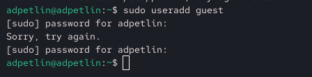{#fig-001 width=100%}

Создаем учётную запись пользователя guest

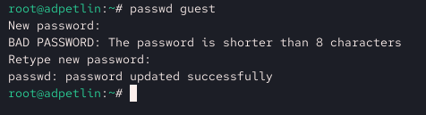{#fig-002 width=100%}

Задаем пароль для пользователя guest.

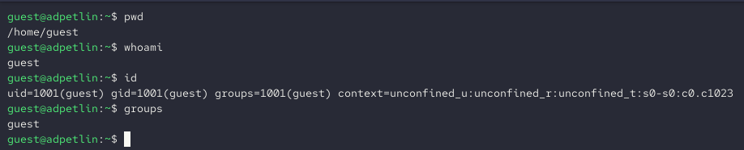{#fig-003 width=100%}

Входим в систему от имени пользователя guest. Определяем директорию, в которой находимся. Уточняем имя пользователя, командой whoami. Уточняем имя пользователя, его группу, а также группы, куда входит. Сравниваем вывод id с выводом команды groups. пользователь, командой id. Сравниваем полученную информацию об имени пользователя с данными, выводимыми в приглашении командной строки. 

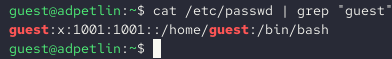{#fig-004 width=100%}

Просматриваем файл /etc/passwd, находим в нем guest, определяем uid и gid, они совпадают.

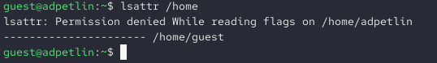{#fig-005 width=100%}

Определить существующие в системе директории не удалось, так как нет прав доступа. Просмотр расширенных атрибутов поддиректорий также не удался.

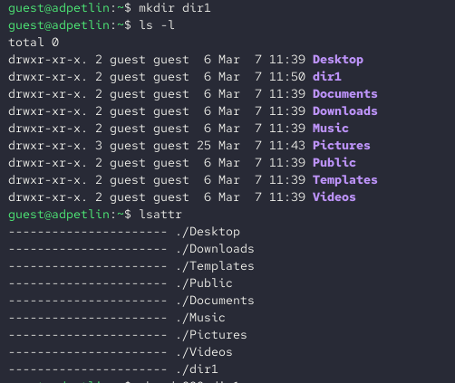{#fig-006 width=100%}

Создаем в домашней директории поддиректорию dir1 командой. Определяем командами ls -l и lsattr, какие права доступа и расширенные атрибуты были выставлены на директорию dir1.

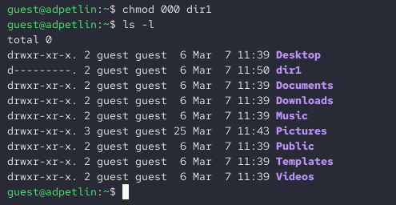{#fig-007 width=100%}

Снимаем с директории dir1 все атрибуты и проверяем командой ls -l. 

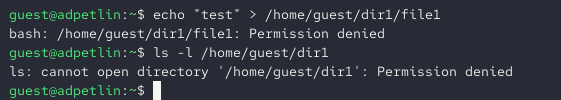{#fig-008 width=100%}

Пытаемся создать в директории dir1 файл file1, что не удается, потому что нет необходимых прав доступа на директорию. Оцениваем, как сообщение об ошибке отразилось на создании файла. 

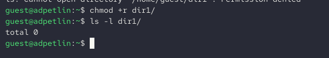{#fig-009 width=100%}

Проверяем действительно ли file1 не находиться в dir1.

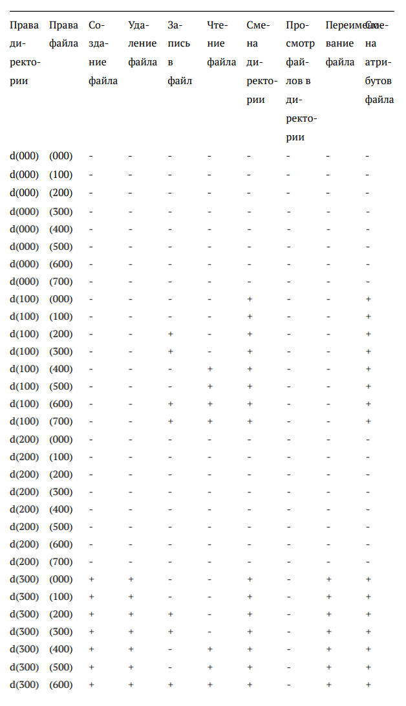{#fig-009 width=100%}

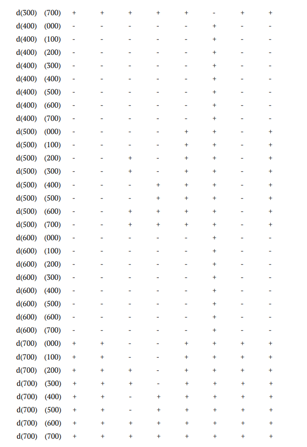{#fig-009 width=100%}

Заполняем таблицу 2.1

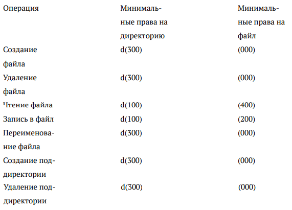{#fig-009 width=100%}

Заполняем таблицу 2.2

# Выводы

Мы получили практические навыки работы в консоли с атрибутами файлов, закрепили теоретические основы дискреционного разграничения доступа в современных системах с открытым кодом на базе ОС Linux.

# Список литературы{.unnumbered}

::: {#refs}
:::
