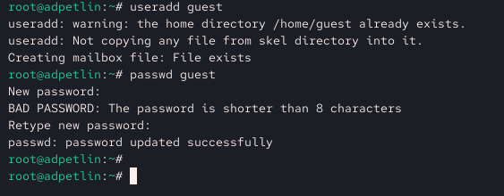
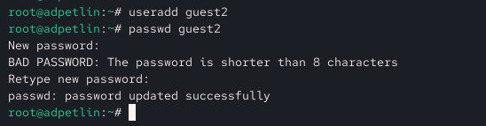
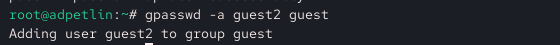
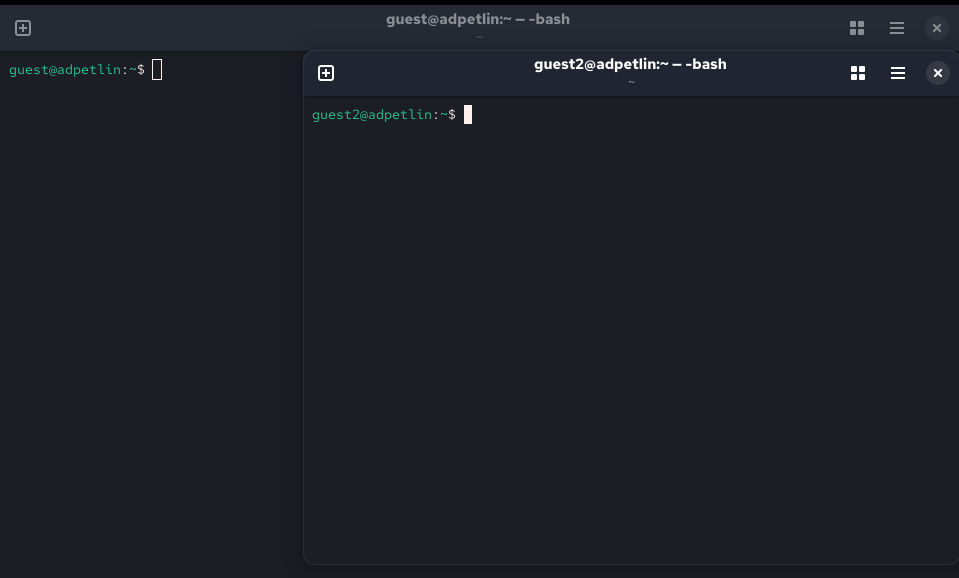
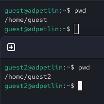
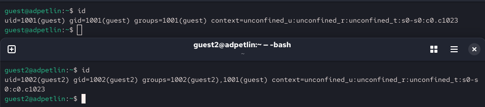
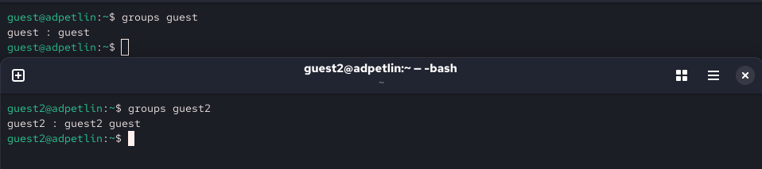
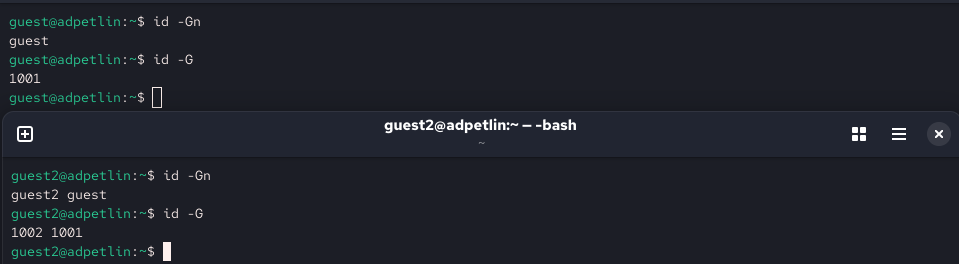
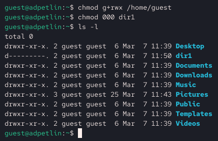

---
## Author
author:
  name: Артём Дмитриевич Петлин
  degrees: Student
  orcid: 0000-0002-0877-7063
  email: 1132246846@pfur.ru
  affiliation:
    - name: Российский университет дружбы народов
      country: Российская Федерация
      postal-code: 117198
      city: Москва
      address: ул. Миклухо-Маклая, д. 6
## Title
title: Лабораторная работа №3
license: CC BY
date: today	
date-format: "YYYY-MM-DD" # Example: 2025-09-06
---

# Информация

## Докладчик

:::::::::::::: {.columns align=center}
::: {.column width="70%"}

  * Петлин Артём Дмитриевич
  * студент
  * группа НПИбд-02-24
  * Российский университет дружбы народов
  * [1132246846@pfur.ru](mailto:1132246846@pfur.ru)
  * <https://github.com/hikrim/study_2025-2026_infosec-intro>

:::
::: {.column width="30%"}


:::
::::::::::::::

# Цель работы

## Цель работы

Получение практических навыков работы в консоли с атрибутами файлов для групп пользователей.

# Задание

## Задание

Получить навыки работы в консоли с атрибутами файлов для групп пользователей.

# Теоретическое введение

## Теоретическое введение

В рамках данной лабораторной работы теоретическое введение не предусмотрено

# Выполнение лабораторной работы

## Ход работы

:::::::::::::: {.columns align=center}
::: {.column width="40%"}

Создаём учётную запись пользователя guest в установленной операционной системе, используя учётную запись администратора: useradd guest
Задаём пароль для пользователя guest, используя учётную запись администратора: passwd guest

:::
::: {.column width="60%"}

{#fig-001 width=100%}

:::
::::::::::::::


## Ход работы

{#fig-002 width=100%}

Аналогично создаём второго пользователя guest2.

## Ход работы

{#fig-003 width=100%}

Добавляем пользователя guest2 в группу guest.

## Ход работы

:::::::::::::: {.columns align=center}
::: {.column width="40%"}

Осуществляем вход в систему от двух пользователей на двух разных консолях: guest на первой консоли и guest2 на второй консоли.

:::
::: {.column width="60%"}

{#fig-004 width=100%}

:::
::::::::::::::


## Ход работы

:::::::::::::: {.columns align=center}
::: {.column width="40%"}

Для обоих пользователей командой pwd определяем директорию, в которой находимся. Совпадает с приглашениями командной строки.

:::
::: {.column width="60%"}

{#fig-005 width=100%}

:::
::::::::::::::


## Ход работы

{#fig-006 width=100%}

Уточняем имя текущего пользователя, его группу, кто входит в неё и к каким группам принадлежит он сам. Определяем командами groups guest и groups guest2, в какие группы входят пользователи guest и guest2.

## Ход работы

:::::::::::::: {.columns align=center}
::: {.column width="30%"}

Сравниваем вывод команды groups с выводом команд id -Gn и id -G

:::
::: {.column width="35%"}

{#fig-007 width=100%}

:::
::: {.column width="35%"}

{#fig-008 width=100%}

:::
::::::::::::::


## Ход работы

{#fig-009 width=100%}

Сравниваем полученную информацию с содержимым файла /etc/group. Просматриваем файл командой cat /etc/group и фиксируем результаты в отчёте.

## Ход работы

{#fig-010 width=100%}

От имени пользователя guest2 выполняем регистрацию пользователя guest2 в группе guest командой newgrp guest.

## Ход работы

:::::::::::::: {.columns align=center}
::: {.column width="40%"}

От имени пользователя guest изменяем права директории /home/guest, разрешая все действия для пользователей группы: chmod g+rwx /home/guest.
От имени пользователя guest снимаем с директории /home/guest/dir1 все атрибуты командой chmod 000 dir1.   

Меняя атрибуты у директории dir1 и файла file1 от имени пользователя guest и делая проверку от пользователя guest2, заполняем табл. 3.1, определяя опытным путём, какие операции разрешены, а какие нет. Если операция разрешена, заносим в таблицу знак «+», если не разрешена — знак «-».

:::
::: {.column width="60%"}

{#fig-011 width=100%}

:::
::::::::::::::


## Таблица 3.1

| Права директории | Права файла | Создание файла | Удаление файла | Запись в файл | Чтение файла | Смена имени директории | Просмотр файлов в директории | Смена имени файла | Просмотр атрибутов файла |
|-------------------------------------------|--------------------------------------------|---------------|-------------|-------------|-------------|--------------|--------------|-------------|---------------|
| ```d--------- (000)``` | ```--------- (000)``` |  - | - | - | - | - | - | - | - |
| ```d----x---- (010)``` | ```--------- (000)``` |  - | - | - | - | + | - | - | + |
| ```d----w---- (020)``` | ```--------- (000)``` |  - | - | - | - | - | - | - | - |
| ```d---wx---- (030)``` | ```--------- (000)``` |  + | + | - | - | + | - | + | + |

## Таблица 3.1

| Права директории | Права файла | Создание файла | Удаление файла | Запись в файл | Чтение файла | Смена имени директории | Просмотр файлов в директории | Смена имени файла | Просмотр атрибутов файла |
|-------------------------------------------|--------------------------------------------|---------------|-------------|-------------|-------------|--------------|--------------|-------------|---------------|
| ```d----r---- (040)``` | ```--------- (000)``` |  - | - | - | - | - | + | - | - |
| ```d---r-x--- (050)``` | ```--------- (000)``` |  - | - | - | - | + | + | - | + |
| ```d---rw---- (060)``` | ```--------- (000)``` |  - | - | - | - | - | + | - | - |
| ```d---rwx--- (070)``` | ```--------- (000)``` |  + | + | - | - | + | + | + | + |

## Таблица 3.1

| Права директории | Права файла | Создание файла | Удаление файла | Запись в файл | Чтение файла | Смена имени директории | Просмотр файлов в директории | Смена имени файла | Просмотр атрибутов файла |
|-------------------------------------------|--------------------------------------------|---------------|-------------|-------------|-------------|--------------|--------------|-------------|---------------|
| ```d--------- (000)``` | ```-----x--- (010)``` |  - | - | - | - | - | - | - | - |
| ```d----x---- (010)``` | ```-----x--- (010)``` |  - | - | - | - | + | - | - | + |
| ```d----w---- (020)``` | ```-----x--- (010)``` |  - | - | - | - | - | - | - | - |
| ```d----wx--- (030)``` | ```-----x--- (010)``` |  + | + | - | - | + | - | + | + |

## Таблица 3.1

| Права директории | Права файла | Создание файла | Удаление файла | Запись в файл | Чтение файла | Смена имени директории | Просмотр файлов в директории | Смена имени файла | Просмотр атрибутов файла |
|-------------------------------------------|--------------------------------------------|---------------|-------------|-------------|-------------|--------------|--------------|-------------|---------------|
| ```d---r----- (040)``` | ```-----x--- (010)``` |  - | - | - | - | - | + | - | - |
| ```d---r-x--- (050)``` | ```-----x--- (010)``` |  - | - | - | - | + | + | - | + |
| ```d---rw---- (060)``` | ```-----x--- (010)``` |  - | - | - | - | - | + | - | - |
| ```d---rwx--- (070)``` | ```-----x--- (010)``` |  + | + | - | - | + | + | + | + |

## Таблица 3.1

| Права директории | Права файла | Создание файла | Удаление файла | Запись в файл | Чтение файла | Смена имени директории | Просмотр файлов в директории | Смена имени файла | Просмотр атрибутов файла |
|-------------------------------------------|--------------------------------------------|---------------|-------------|-------------|-------------|--------------|--------------|-------------|---------------|
| ```d--------- (000)``` | ```----w---- (020)``` |  - | - | - | - | - | - | - | - |
| ```d-----x--- (010)``` | ```----w---- (020)``` |  - | - | + | - | + | - | - | + |
| ```d----w---- (020)``` | ```----w---- (020)``` |  - | - | - | - | - | - | - | - |
| ```d----wx--- (030)``` | ```----w---- (020)``` |  + | + | + | - | + | - | + | + |

## Таблица 3.1

| Права директории | Права файла | Создание файла | Удаление файла | Запись в файл | Чтение файла | Смена имени директории | Просмотр файлов в директории | Смена имени файла | Просмотр атрибутов файла |
|-------------------------------------------|--------------------------------------------|---------------|-------------|-------------|-------------|--------------|--------------|-------------|---------------|
| ```d---r----- (040)``` | ```----w---- (020)``` |  - | - | - | - | - | + | - | - |
| ```d---r-x--- (050)``` | ```----w---- (020)``` |  - | - | + | - | + | + | - | + |
| ```d---rw---- (060)``` | ```----w---- (020)``` |  - | - | - | - | - | + | - | - |
| ```d---rwx--- (070)``` | ```----w---- (020)``` |  + | + | + | - | + | + | + | + |

## Таблица 3.1

| Права директории | Права файла | Создание файла | Удаление файла | Запись в файл | Чтение файла | Смена имени директории | Просмотр файлов в директории | Смена имени файла | Просмотр атрибутов файла |
|-------------------------------------------|--------------------------------------------|---------------|-------------|-------------|-------------|--------------|--------------|-------------|---------------|
| ```d--------- (000)``` | ```----wx--- (030)``` |  - | - | - | - | - | - | - | - |
| ```d-----x--- (010)``` | ```----wx--- (030)``` |  - | - | + | - | + | - | - | + |
| ```d----w---- (020)``` | ```----wx--- (030)``` |  - | - | - | - | - | - | - | - |
| ```d----wx--- (030)``` | ```----wx--- (030)``` |  + | + | + | - | + | - | + | + |

## Таблица 3.1

| Права директории | Права файла | Создание файла | Удаление файла | Запись в файл | Чтение файла | Смена имени директории | Просмотр файлов в директории | Смена имени файла | Просмотр атрибутов файла |
|-------------------------------------------|--------------------------------------------|---------------|-------------|-------------|-------------|--------------|--------------|-------------|---------------|
| ```d---r----- (040)``` | ```----wx--- (030)``` |  - | - | - | - | - | + | - | - |
| ```d---r-x--- (050)``` | ```----wx--- (030)``` |  - | - | + | - | + | + | - | + |
| ```d---rw---- (060)``` | ```----wx--- (030)``` |  - | - | - | - | - | + | - | - |
| ```d---rwx--- (070)``` | ```----wx--- (030)``` |  + | + | + | - | + | + | + | + |

## Таблица 3.1

| Права директории | Права файла | Создание файла | Удаление файла | Запись в файл | Чтение файла | Смена имени директории | Просмотр файлов в директории | Смена имени файла | Просмотр атрибутов файла |
|-------------------------------------------|--------------------------------------------|---------------|-------------|-------------|-------------|--------------|--------------|-------------|---------------|
| ```d--------- (000)``` | ```---r----- (040)``` |  - | - | - | - | - | - | - | - |
| ```d-----x--- (010)``` | ```---r----- (040)``` |  - | - | - | + | + | - | - | + |
| ```d----w---- (020)``` | ```---r----- (040)``` |  - | - | - | - | - | - | - | - |
| ```d----wx--- (030)``` | ```---r----- (040)``` |  + | + | - | + | + | - | + | + |

## Таблица 3.1

| Права директории | Права файла | Создание файла | Удаление файла | Запись в файл | Чтение файла | Смена имени директории | Просмотр файлов в директории | Смена имени файла | Просмотр атрибутов файла |
|-------------------------------------------|--------------------------------------------|---------------|-------------|-------------|-------------|--------------|--------------|-------------|---------------|
| ```d---r----- (040)``` | ```---r----- (040)``` |  - | - | - | - | - | + | - | - |
| ```d---r-x--- (050)``` | ```---r----- (040)``` |  - | - | - | + | + | + | - | + |
| ```d---rw---- (060)``` | ```---r----- (040)``` |  - | - | - | - | - | + | - | - |
| ```d---rwx--- (070)``` | ```---r----- (040)``` |  + | + | - | + | + | + | + | + |

## Таблица 3.1

| Права директории | Права файла | Создание файла | Удаление файла | Запись в файл | Чтение файла | Смена имени директории | Просмотр файлов в директории | Смена имени файла | Просмотр атрибутов файла |
|-------------------------------------------|--------------------------------------------|---------------|-------------|-------------|-------------|--------------|--------------|-------------|---------------|
| ```d--------- (000)``` | ```---r-x--- (050)``` |  - | - | - | - | - | - | - | - |
| ```d-----x--- (010)``` | ```---r-x--- (050)``` |  - | - | - | + | + | - | - | + |
| ```d----w---- (020)``` | ```---r-x--- (050)``` |  - | - | - | - | - | - | - | - |
| ```d----wx--- (030)``` | ```---r-x--- (050)``` |  + | + | - | + | + | - | + | + |

## Таблица 3.1

| Права директории | Права файла | Создание файла | Удаление файла | Запись в файл | Чтение файла | Смена имени директории | Просмотр файлов в директории | Смена имени файла | Просмотр атрибутов файла |
|-------------------------------------------|--------------------------------------------|---------------|-------------|-------------|-------------|--------------|--------------|-------------|---------------|
| ```d---r----- (040)``` | ```---r-x--- (050)``` |  -	|  -  |  -  |  -  |  -	|  +  |  -  |  -  |
| ```d---r-x--- (050)``` | ```---r-x--- (050)``` |  -	|  -  |	 -	|  +  |  +	|  +  |  -  |  +  |
| ```d---rw---- (060)``` | ```---r-x--- (050)``` |  -	|  -  |  -  |  -  |  -	|  +  |  -  |  -  |
| ```d---rwx--- (070)``` | ```---r-x--- (050)``` |  +	|  +  |	 -	|  +  |  +	|  +  |  +  |  +  |

## Таблица 3.1

| Права директории | Права файла | Создание файла | Удаление файла | Запись в файл | Чтение файла | Смена имени директории | Просмотр файлов в директории | Смена имени файла | Просмотр атрибутов файла |
|-------------------------------------------|--------------------------------------------|---------------|-------------|-------------|-------------|--------------|--------------|-------------|---------------|
| ```d--------- (000)``` | ```---rw---- (060)``` |  -	|  -  |  -  |  -  |  -	|  -  |  -  |  -  |
| ```d-----x--- (010)``` | ```---rw---- (060)``` |  -	|  -  |  +	|  +  |  +	|  -  |  -  |  +  |
| ```d----w---- (020)``` | ```---rw---- (060)``` |  -	|  -  |  -  |  -  |  -	|  -  |  -  |  -  |
| ```d----wx--- (030)``` | ```---rw---- (060)``` |  +	|  +  |	 +	|  +  |  +	|  -  |  +  |  +  |

## Таблица 3.1

| Права директории | Права файла | Создание файла | Удаление файла | Запись в файл | Чтение файла | Смена имени директории | Просмотр файлов в директории | Смена имени файла | Просмотр атрибутов файла |
|-------------------------------------------|--------------------------------------------|---------------|-------------|-------------|-------------|--------------|--------------|-------------|---------------|
| ```d---r----- (040)``` | ```---rw---- (060)``` |  -	|  -  |  -  |  -  |  -	|  +  |  -  |  -  |
| ```d---r-x--- (050)``` | ```---rw---- (060)``` |  -  |  -  |	 +	|  +  |  +	|  +  |  -  |  +  |
| ```d---rw---- (060)``` | ```---rw---- (060)``` |  -	|  -  |  -  |  -  |  -	|  +  |  -  |  -  |
| ```d---rwx--- (070)``` | ```---rw---- (060)``` |  +  |  +  |	 +	|  +  |  +	|  +  |  +  |  +  |

## Таблица 3.1

| Права директории | Права файла | Создание файла | Удаление файла | Запись в файл | Чтение файла | Смена имени директории | Просмотр файлов в директории | Смена имени файла | Просмотр атрибутов файла |
|-------------------------------------------|--------------------------------------------|---------------|-------------|-------------|-------------|--------------|--------------|-------------|---------------|
| ```d--------- (000)``` | ```---rwx--- (070)``` |  -	|  -  |  -  |  -  |  -	|  -  |  -  |  -  |
| ```d-----x--- (010)``` | ```---rwx--- (070)``` |  -  |  -  |	 +	|  +  |  +	|  -  |  -  |  +  |
| ```d----w---- (020)``` | ```---rwx--- (070)``` |  -	|  -  |  -  |  -  |  -	|  -  |  -  |  -  |
| ```d----wx--- (030)``` | ```---rwx--- (070)``` |  +  |  +  |	 +	|  +  |  +	|  -  |  +  |  +  |

## Таблица 3.1

| Права директории | Права файла | Создание файла | Удаление файла | Запись в файл | Чтение файла | Смена имени директории | Просмотр файлов в директории | Смена имени файла | Просмотр атрибутов файла |
|-------------------------------------------|--------------------------------------------|---------------|-------------|-------------|-------------|--------------|--------------|-------------|---------------|
| ```d---r----- (040)``` | ```---rwx--- (070)``` |  -	|  -  |  -  |  -  |  -	|  +  |  -  |  -  |
| ```d---r-x--- (050)``` | ```---rwx--- (070)``` |  -  |  -  |	 +	|  +  |  +	|  +  |  -  |  +  |
| ```d---rw---- (060)``` | ```---rwx--- (070)``` |  -	|  -  |  -  |  -  |  -	|  +  |  -  |  -  |
| ```d---rwx--- (070)``` | ```---rwx--- (070)``` |  +  |  +  |	 +	|  +  |  +	|  +  |  +  |  +  |

## Таблица 3.2

На основании заполненной таблицы определяем минимально необходимые права для выполнения пользователем guest2 операций внутри директории dir1 и заполняем табл. 3.2.

|        Операция        | Права на директорию | Права на файл |
|------------------------|---------------------------------|---------------------------|
|     Создание файла     |           ```d----wx--- (030)```      |      ```---------- (000)```     |	    
|     Удаление файла     |           ```d----wx--- (030)```      |      ```---------- (000)```     |
|      Чтение файла      |           ```d-----x--- (010)```      |      ```----r----- (040)```     |
|      Запись в файл     |           ```d-----x--- (010)```      |      ```-----w---- (020)```     |
|  Переименование файла  |           ```d----wx--- (030)```      |      ```---------- (000)```     |
| Создание поддиректории |           ```d----wx--- (030)```      |      ```---------- (000)```     |
| Удаление поддиректории |           ```d----wx--- (030)```      |      ```---------- (000)```     |


# Выводы

Мы получили практические навыки работы в консоли с атрибутами файлов для групп пользователей.

# Список литературы{.unnumbered}

::: {#refs}
:::
