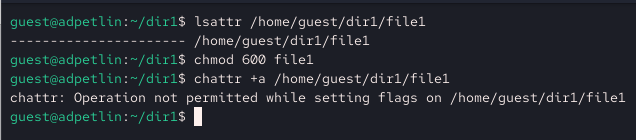
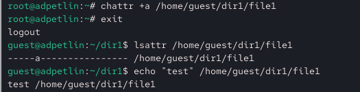
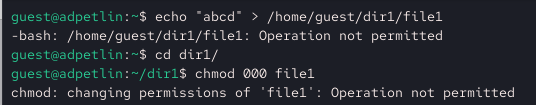
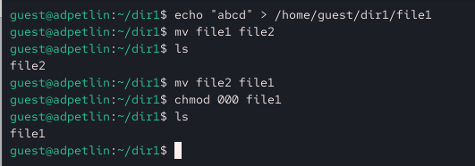
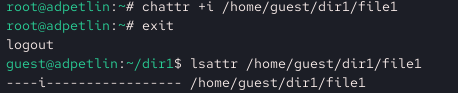
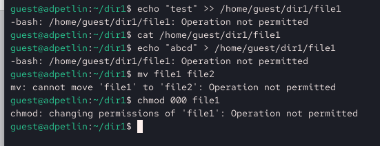

---
## Author
author:
  name: Артём Дмитриевич Петлин
  degrees: student
  orcid: 0000-0002-0877-7063
  email: kulyabov-ds@rudn.ru
  affiliation:
    - name: Российский университет дружбы народов
      country: Российская Федерация
      postal-code: 117198
      city: Москва
      address: ул. Миклухо-Маклая, д. 6

## Title
title: "Лабораторная работа №4"
license: "CC BY"
---

# Цель работы

Получение практических навыков работы в консоли с расширенными
атрибутами файлов.

# Задание

1. Выполнить некоторые действия с расширенным атрибутом "а" на файле home/guest/dir1/file1.
2. Аналогично выполнить для атрибута "i" на том же файле.

# Теоретическое введение

В рамках данной лабораторной работы теоретическое введение отсутствует.

# Выполнение лабораторной работы

{#fig-001 width=100%}

От имени пользователя guest определяем расширенные атрибуты файла /home/guest/dir1/file1. Устанавливаем командой на файл file1 права, разрешающие чтение и запись для владельца файла. Пытаемся установить на файл /home/guest/dir1/file1 расширенный атрибут a от имени пользователя guest. В ответ получаем отказ от выполнения операции.

{#fig-002 width=100%}

Повышаем свои права. Пытаемся установить расширенный атрибут a на файл /home/guest/dir1/file1 от имени суперпользователя. От пользователя guest проверяем правильность установления атрибута. Выполняем дозапись в файл file1 слова «test». После этого выполняем чтение файла file1. Убеждаемся, что слово test было успешно записано в file1. 

{#fig-003 width=100%}

Пытаемся удалить файл file1 либо стереть имеющуюся в нём информацию. Пытаемся переименовать файл. Пытаемся установить на файл file1 права, запрещающие чтение и запись для владельца файла. Выполнить указанные команды не удалось.

{#fig-004 width=100%}

Снимаем расширенный атрибут a с файла /home/guest/dir1/file1 от имени суперпользователя. Повторяем операции, которые ранее не удавалось выполнить. Теперь выполнить указанные команды удалось.

{#fig-005 width=100%}

{#fig-006 width=100%}

Повторяем действия по шагам, заменив атрибут «a» атрибутом «i». Фиксируем, удалось ли дозаписать информацию в файл. Выполнить указанные команды не удалось.

# Выводы

Мы получили практические навыки работы в консоли с расширенными атрибутами файлов.

# Список литературы{.unnumbered}

::: {#refs}
:::
