---
## Author
author:
  name: Артём Дмитриевич Петлин
  degrees: Student
  orcid: 0000-0002-0877-7063
  email: 1132246846@pfur.ru
  affiliation:
    - name: Российский университет дружбы народов
      country: Российская Федерация
      postal-code: 117198
      city: Москва
      address: ул. Миклухо-Маклая, д. 6
## Title
title: Лабораторная работа №5
license: CC BY
date: today	
date-format: "YYYY-MM-DD" # Example: 2025-09-06
---

# Информация

## Докладчик

:::::::::::::: {.columns align=center}
::: {.column width="70%"}

  * Петлин Артём Дмитриевич
  * студент
  * группа НПИбд-02-24
  * Российский университет дружбы народов
  * [1132246846@pfur.ru](mailto:1132246846@pfur.ru)
  * <https://github.com/hikrim/study_2025-2026_infosec-intro>

:::
::: {.column width="30%"}


:::
::::::::::::::

# Цель работы

## Цель работы

Изучение механизмов изменения идентификаторов, применения
SetUID- и Sticky-битов. Получение практических навыков работы в консоли с дополнительными атрибутами. Рассмотрение работы механизма
смены идентификатора процессов пользователей, а также влияние бита
Sticky на запись и удаление файлов.

# Задание

## Задание

- Создание программы
- Исследование Sticky-бита

# Теоретическое введение

## Теоретическое введение

Помимо прав администратора для выполнения части заданий потребу-
ются средства разработки приложений. В частности, при подготовке стенда
следует убедиться, что в системе установлен компилятор gcc (для этого, на-
пример, можно ввести команду gcc -v). Если же gcc не установлен, то его
необходимо установить, например, командой  

```yum install gcc```  

которая определит зависимости и установит следующие пакеты: gcc, cloog-
ppl, срр, glibc-devel, glibc-headers, kernel-headers, libgomp, ppl, cloog-ppl,
срр, gcc, glibc-devel, glibc-headers, kernel-headers, libgomp, libstdc++-devel,
mpfr, ppl, glibc, glibc-common, libgcc, libstdc++.

# Выполнение лабораторной работы

## Ход работы 

:::::::::::::: {.columns align=center}
::: {.column width="40%"}

Входим в систему от имени пользователя guest. Создаём программу simpleid.c с кодом для вывода эффективных UID и GID. Компилируем программу и убеждаемся, что файл создан.

:::
::: {.column width="60%"}

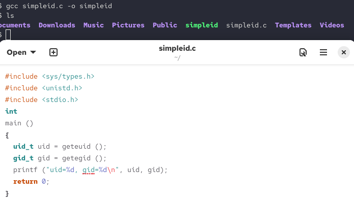{#fig-001 width=100%}

:::
::::::::::::::


## Ход работы 

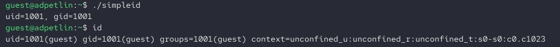{#fig-002 width=100%}

Выполняем программу simpleid. Выполняем системную программу id и сравниваем результаты. Обе команды показывают одинаковые идентификаторы пользователя guest, так как программа запущена без специальных битов.

## Ход работы 

:::::::::::::: {.columns align=center}
::: {.column width="40%"}

Усложняем программу, добавляя вывод действительных идентификаторов (real_uid, real_gid), сохраняем как simpleid2.c. Компилируем и запускаем simpleid2.

:::
::: {.column width="60%"}

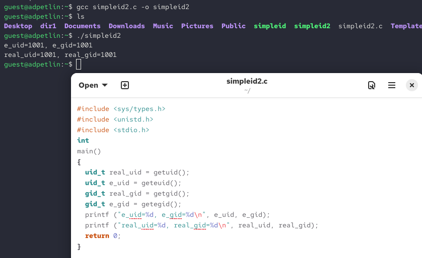{#fig-003 width=100%}

:::
::::::::::::::


## Ход работы 

:::::::::::::: {.columns align=center}
::: {.column width="50%"}

От имени суперпользователя выполняем команды. Первая команда меняет владельца файла на root и группу на guest, вторая устанавливает SetUID-бит, что позволяет программе выполняться с правами владельца файла (root), а не пользователя, запустившего её. Проверяем правильность установки атрибутов. В выводе видим букву 's' на месте исполнительного бита владельца, что подтверждает установку SetUID-бита. Владелец файла — root. Запускаем simpleid2 и id, сравниваем результаты.

:::
::: {.column width="50%"}

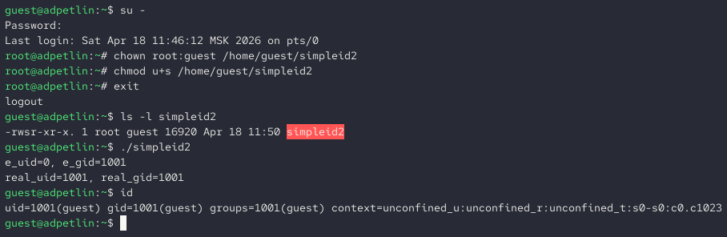{#fig-004 width=100%}

:::
::::::::::::::


## Ход работы 

:::::::::::::: {.columns align=center}
::: {.column width="40%"}

Создаём программу readfile.c для чтения файлов. Компилируем её. Меняем владельца файла и права так, чтобы только root мог читать его.
Проверяем, что пользователь guest не может прочитать файл.

:::
::: {.column width="60%"}

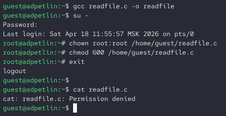{#fig-005 width=100%}

:::
::::::::::::::


## Ход работы 

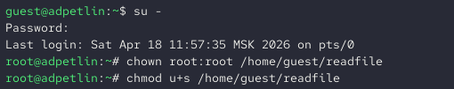{#fig-006 width=100%}

Устанавливаем setUID-бит. 

## Ход работы 

:::::::::::::: {.columns align=center}
::: {.column width="40%"}

Проверяем, может ли программа readfile прочитать файлы readfile.c и /etc/shadow? Да, программа может прочитать файл readfile.c. Программа может прочитать /etc/shadow.

:::
::: {.column width="60%"}

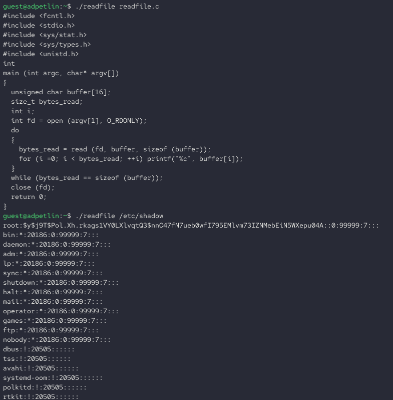{#fig-007 width=100%}

:::
::::::::::::::


## Ход работы 

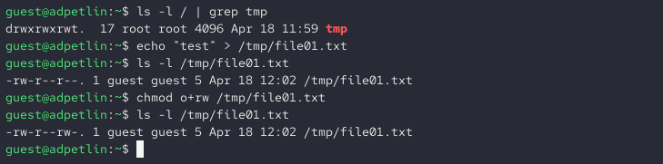{#fig-008 width=100%}

Выясняем, установлен ли атрибут Sticky на директории /tmp. Он установлен. Просматриваем атрибуты файла и разрешаем чтение и запись для «остальных».

## Ход работы 

:::::::::::::: {.columns align=center}
::: {.column width="50%"}

От пользователя guest2 пробуем прочитать файл. Чтение успешно. От пользователя guest2 пробуем дозаписать в файл слово test2. Дозапись должна быть успешна (у меня какая-то ошибка). Проверяем содержимое файла.
От пользователя guest2 пробуем записать слово test3, стирая содержимое. Операция снова должна быть успешна. Проверяем содержимое: должно было быть "test3". От пользователя guest2 пробуем удалить файл, у меня получилось, что удаление возможно, но это так не должно быть.

:::
::: {.column width="50%"}

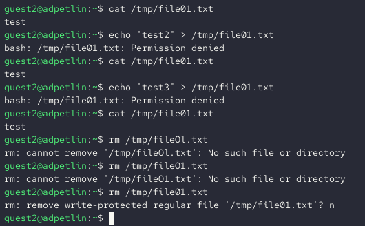{#fig-009 width=100%}

:::
::::::::::::::


## Ход работы 

:::::::::::::: {.columns align=center}
::: {.column width="40%"}

Повышаем права до суперпользователя и снимаем Sticky-бит с /tmp. От пользователя guest2 проверяем отсутствие атрибута t. После снятия Sticky-бита пользователь guest2 может удалить файл /tmp/file01.txt. 

:::
::: {.column width="60%"}

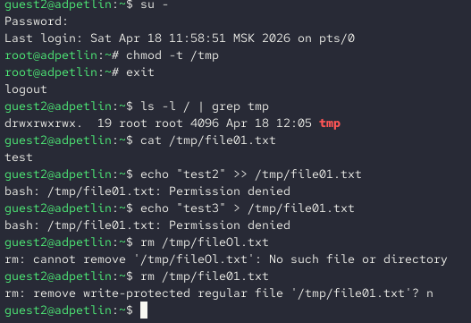{#fig-010 width=100%}

:::
::::::::::::::


## Ход работы 

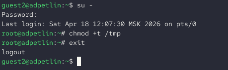{#fig-011 width=100%}

Возвращаем атрибут t на директорию /tmp: chmod +t /tmp


# Выводы

## Выводы

Мы изучили механизмы изменения идентификаторов, применения
SetUID- и Sticky-битов. Мы получили практические навыки работы в консоли с дополнительными атрибутами. Мы рассмотрели работы механизма
смены идентификатора процессов пользователей, а также влияние бита
Sticky на запись и удаление файлов.

# Список литературы{.unnumbered}

## Список литературы{.unnumbered}

::: {#refs}
:::
