---
## Author
author:
  name: Артём Дмитриевич Петлин
  degrees: Student
  orcid: 0000-0002-0877-7063
  email: 1132246846@pfur.ru
  affiliation:
    - name: Российский университет дружбы народов
      country: Российская Федерация
      postal-code: 117198
      city: Москва
      address: ул. Миклухо-Маклая, д. 6
## Title
title: Лабораторная работа №6
license: CC BY
date: today	
date-format: "YYYY-MM-DD" # Example: 2025-09-06
---

# Информация

## Докладчик

:::::::::::::: {.columns align=center}
::: {.column width="70%"}

  * Петлин Артём Дмитриевич
  * студент
  * группа НПИбд-02-24
  * Российский университет дружбы народов
  * [1132246846@pfur.ru](mailto:1132246846@pfur.ru)
  * <https://github.com/hikrim/study_2025-2026_infosec-intro>

:::
::: {.column width="30%"}

:::
::::::::::::::

# Цель работы

## Цель работы

Развить навыки администрирования ОС Linux. Получить первое практическое знакомство с технологией SELinux.
Проверить работу SELinux на практике совместно с веб-сервером Apache.

# Задание

## Задание

Для проведения указанной лабораторной работы на одно рабочее место требуется компьютер с установленной операционной системой Linux,
поддерживающей технологию SELinux.
Предполагается использовать стандартный дистрибутив Rocky Linux с включённой политикой SELinux targeted и режимом enforcing. Для выполнения заданий требуется наличие учётной записи администратора (root) и
учётной записи обычного пользователя. Постоянно работать от учётной записи root неправильно с точки зрения безопасности.

# Теоретическое введение

## Теоретическое введение

При подготовке стенда обратите внимание, что необходимая для работы и указанная выше политика targeted и режим enforcing используются в данном дистрибутиве по умолчанию, т.е. каких-то специальных настроек не требуется. При этом следует убедиться, что политика и режим включены, особенно когда работа будет проводиться повторно и велика вероятность изменений при предыдущем использовании системы

# Выполнение лабораторной работы

## Ход работы 

:::::::::::::: {.columns align=center}
::: {.column width="40%"}

Входим в систему с полученными учётными данными и убеждаемся, что SELinux работает в режиме enforcing политики targeted с помощью команд getenforce и sestatus.

:::
::: {.column width="60%"}

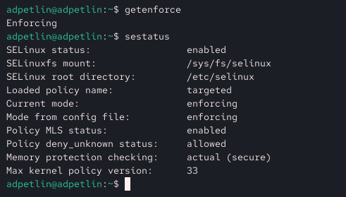{#fig-001 width=100%}

:::
::::::::::::::

## Ход работы 

:::::::::::::: {.columns align=center}
::: {.column width="40%"}

Обращаемся с помощью браузера к веб-серверу, запущенному на нашем компьютере, и убеждаемся, что последний работает.

:::
::: {.column width="60%"}

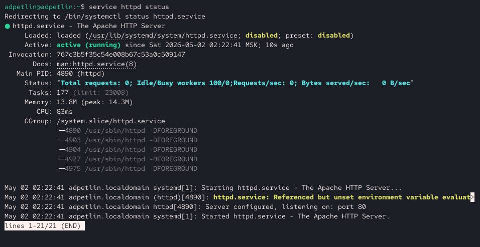{#fig-002 width=100%}

:::
::::::::::::::

## Ход работы 

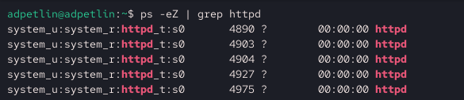{#fig-003 width=100%}

Находим веб-сервер Apache в списке процессов. Процесс httpd имеет контекст system_r:httpd_t:s0, где httpd_t — тип процесса, отвечающий за доступ к файлам с типом httpd_sys_content_t.

## Ход работы 

:::::::::::::: {.columns align=center}
::: {.column width="40%"}

Смотрим текущее состояние переключателей SELinux для Apache. Обращаем внимание, что многие из них находятся в положении «off».

:::
::: {.column width="60%"}

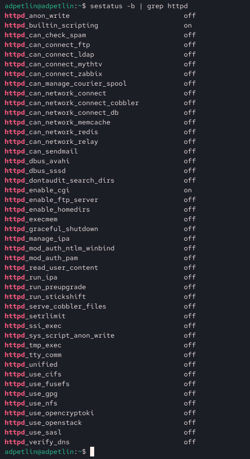{#fig-004 width=100%}

:::
::::::::::::::

## Ход работы 

:::::::::::::: {.columns align=center}
::: {.column width="40%"}

Команда seinfo показывает количество пользователей, ролей, типов, правил и булевых переключателей в политике. В политике targeted по умолчанию определены тысячи типов, что позволяет гибко разграничивать доступ.

:::
::: {.column width="60%"}

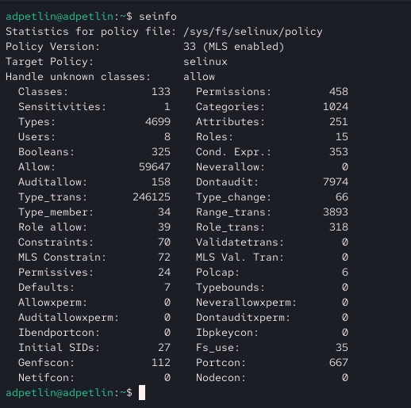{#fig-005 width=100%}

:::
::::::::::::::

## Ход работы 

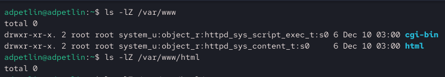{#fig-006 width=100%}

Определяем тип файлов и поддиректорий, находящихся в директории /var/www. Директория /var/www имеет тип httpd_sys_content_t, что разрешает веб-серверу читать её содержимое. Определяем тип файлов, находящихся в директории /var/www/html. Файлы в /var/www/html по умолчанию получают тип httpd_sys_content_t при создании суперпользователем. По умолчанию запись в /var/www/html разрешена только пользователю root, так как директория принадлежит root:root с правами 755.

## Ход работы 

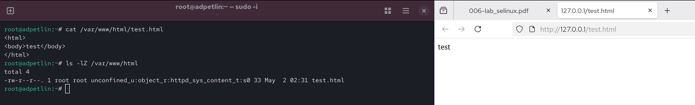{#fig-007 width=100%}

Создаём от имени суперпользователя html-файл /var/www/html/test.html следующего содержания. Проверяем контекст созданного файла. Файлу автоматически присваивается контекст unconfined_u:object_r:httpd_sys_content_t:s0. Тип httpd_sys_content_t позволяет процессу httpd читать файл. Обращаемся к файлу через веб-сервер, введя в браузере адрес http://127.0.0.1/test.html. Убеждаемся, что файл был успешно отображён.

## Ход работы 

:::::::::::::: {.columns align=center}
::: {.column width="50%"}

Для httpd определены типы: httpd_sys_content_t (статический контент), httpd_sys_script_exec_t (скрипты), httpd_log_t (логи) и др. Наш файл имеет httpd_sys_content_t, поэтому httpd может его читать. Изменяем контекст файла /var/www/html/test.html с httpd_sys_content_t на samba_share_t. После этого проверяем, что контекст поменялся. Пытаемся ещё раз получить доступ к файлу через веб-сервер, введя в браузере адрес http://127.0.0.1/test.html. Получаем ошибку 403 Forbidden. Файл не отображается, потому что политика SELinux запрещает процессу httpd_t доступ к файлам с типом samba_share_t, несмотря на стандартные права доступа.

:::
::: {.column width="50%"}

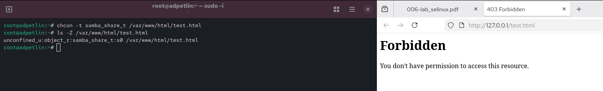{#fig-008 width=100%}

:::
::::::::::::::

## Ход работы 

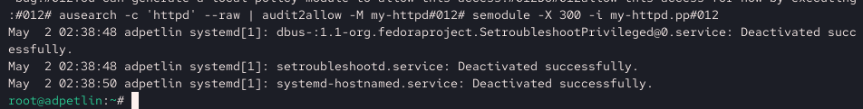{#fig-009 width=100%}

Анализируем ситуацию. Просматриваем log-файлы веб-сервера Apache и системный лог-файл. В логах появляются записи об отказе в доступе от SELinux. Ошибка возникает не из-за прав Linux, а из-за мандатной политики: тип процесса httpd_t не имеет разрешения читать объекты типа samba_share_t.

## Ход работы 

:::::::::::::: {.columns align=center}
::: {.column width="40%"}

Пытаемся запустить веб-сервер Apache на прослушивание TCP-порта 81. Для этого в файле /etc/httpd/httpd.conf находим строчку Listen 80 и заменяем её на Listen 81.
Выполняем перезапуск веб-сервера Apache.

:::
::: {.column width="60%"}

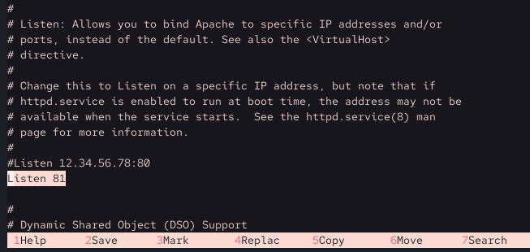{#fig-010 width=100%}

:::
::::::::::::::

## Ход работы 

:::::::::::::: {.columns align=center}
::: {.column width="40%"}

Произошёл сбой. Apache не может запуститься на порту 81, потому что по умолчанию этот порт не помечен как допустимый для httpd в политике SELinux. SELinux блокирует привязку процесса httpd_t к порту, не имеющему типа http_port_t.

:::
::: {.column width="60%"}

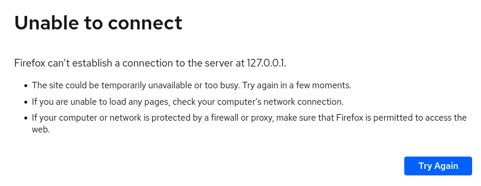{#fig-011 width=100%}

:::
::::::::::::::

## Ход работы 

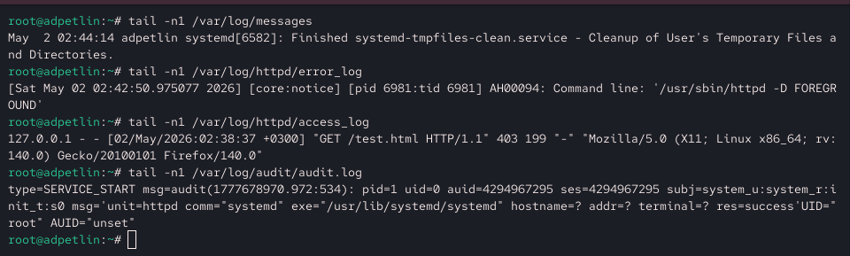{#fig-012 width=100%}

Анализируем лог-файл /var/log/messages. Просматриваем файлы /var/log/httpd/error_log, /var/log/httpd/access_log и /var/log/audit/audit.log. Записи об ошибке появляются в /var/log/audit/audit.log и /var/log/httpd/error_log. В access_log записей нет, так как запросы не обрабатывались.

## Ход работы 

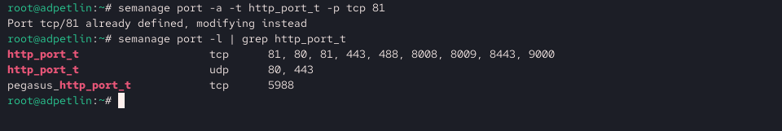{#fig-013 width=100%}

Выполняем команду semanage port -a -t http_port_t -p tcp 81. После этого проверяем список портов и убеждаемся, что порт 81 появился в списке.

## Ход работы 

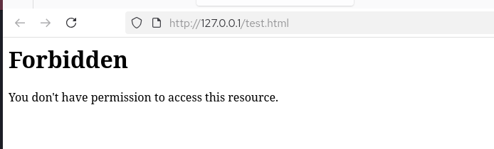{#fig-014 width=100%}

Теперь сервер запустился, потому что мы явно добавили порт 81 в список разрешённых для типа http_port_t. SELinux теперь разрешает процессу httpd_t привязываться к этому порту.

## Ход работы 

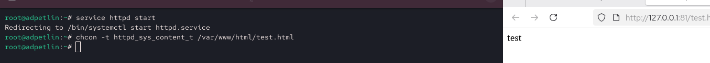{#fig-015 width=100%}

Возвращаем контекст httpd_sys_content_t к файлу /var/www/html/test.html. После этого пытаемся получить доступ к файлу через веб-сервер, введя в браузере адрес http://127.0.0.1:81/test.html.
Файл успешно отображается, так как контекст восстановлен и порт 81 добавлен в разрешённые.

## Ход работы 

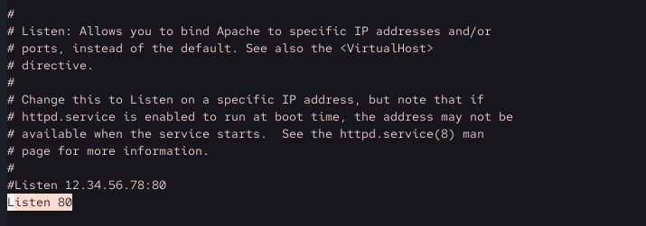{#fig-016 width=100%}

Исправляем обратно конфигурационный файл apache, вернув Listen 80.

## Ход работы 

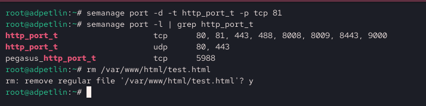{#fig-017 width=100%}

Удаляем привязку http_port_t к 81 порту и проверяем, что порт 81 удалён. Удаляем файл /var/www/html/test.html: rm /var/www/html/test.html.

# Выводы

## Выводы

Мы развили навыки администрирования ОС Linux. Получили первое практическое знакомство с технологией SELinux.
Мы проверили работу SELinux на практике совместно с веб-сервером Apache.

# Список литературы{.unnumbered}

## Список литературы{.unnumbered}

::: {#refs}
:::
