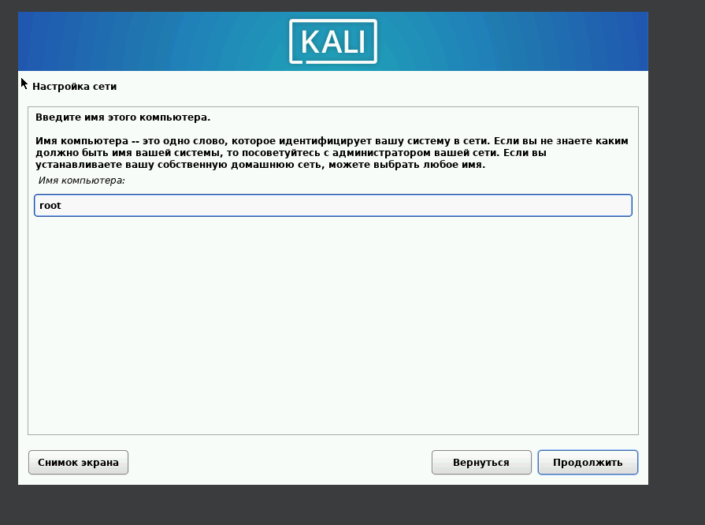
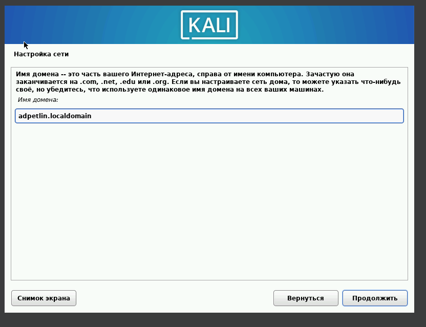
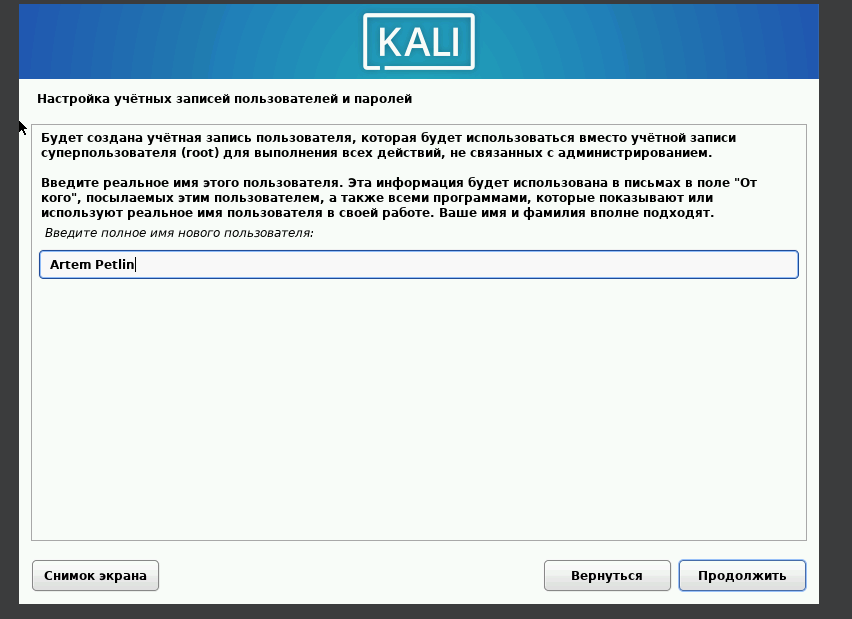
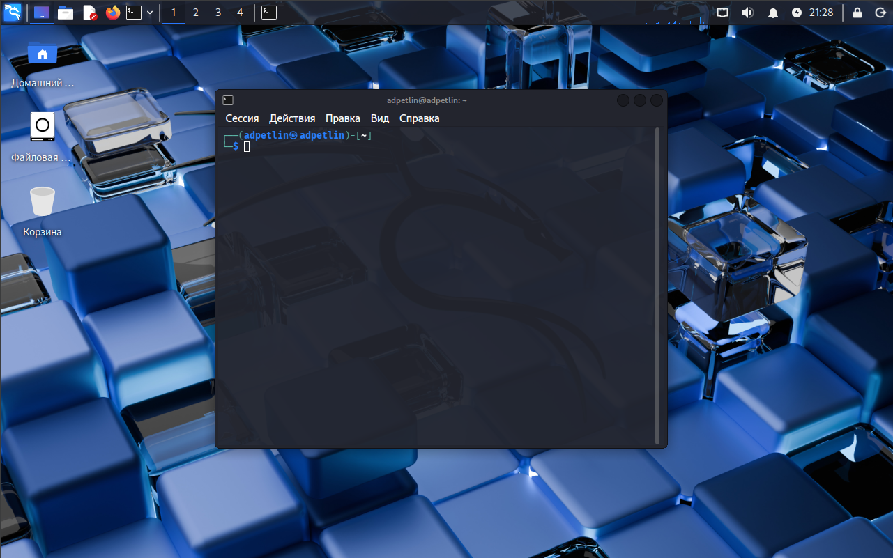

---
## Author
author:
  name: Артём Дмитриевич Петлин
  degrees: Student
  orcid: 0000-0002-0877-7063
  email: 1132246846@rudn.ru
  affiliation:
    - name: Российский университет дружбы народов
      country: Российская Федерация
      postal-code: 117198
      city: Москва
      address: ул. Миклухо-Маклая, д. 6

## Title
title: "Индивидуальный проект. Этап 1"
license: "CC BY"
---

# Цель работы

Установить дистрибутив Kali Linux в виртуальную машину.

# Задание

- Установите дистрибутив Kali Linux в виртуальную машину.
- В качестве среды виртуализации предлагается использовать VirtualBox.

# Теоретическое введение

Ищутся уязвимости в специально предназначенном для этого веб приложении под названием Damn Vulnerable Web Application (DVWA).
Назначение DVWA — попрактиковаться в некоторых самых распространённых веб уязвимостях.
Предлагается попробовать и обнаружить так много уязвимостей, как сможете.

# Выполнение лабораторной работы

{#fig-001 width=100%}

Устанавливаем название сети

{#fig-002 width=100%}

Устанавливаем название домена

{#fig-003 width=100%}

Устанавливаем полное имя пользователя, логин устанавливаем adpetlin

{#fig-004 width=100%}

Вид установленной системы

# Выводы

Мы установили дистрибутив Kali Linux в виртуальную машину.

# Список литературы{.unnumbered}

::: {#refs}
:::
