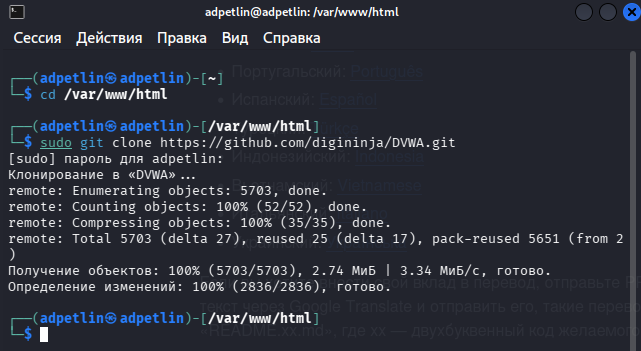
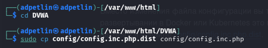
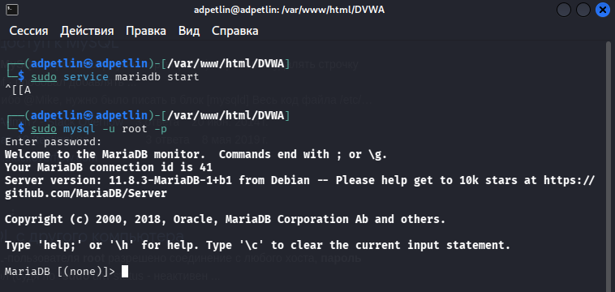
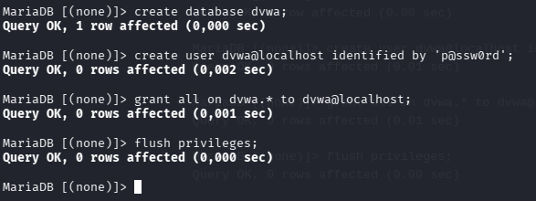
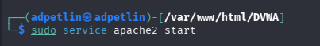
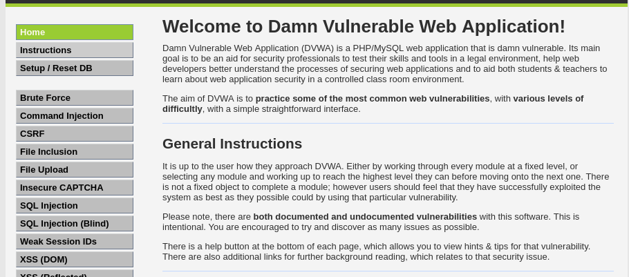

---
## Author
author:
  name: Артём Дмитриевич Петлин
  degrees: student
  orcid: 0000-0002-0877-7063
  email: kulyabov-ds@rudn.ru
  affiliation:
    - name: Российский университет дружбы народов
      country: Российская Федерация
      postal-code: 117198
      city: Москва
      address: ул. Миклухо-Маклая, д. 6

## Title
title: "Индивидуальный проект. Этап 2"
license: "CC BY"
---

# Цель работы

Научиться устанавливать DVWA в гостевую систему к Kali Linux.

# Задание

Установите DVWA в гостевую систему к Kali Linux.

# Теоретическое введение

- Некоторые из уязвимостей веб приложений, который содержит DVWA:  

    Брутфорс: Брутфорс HTTP формы страницы входа - используется для тестирования инструментов по атаке на пароль методом грубой силы и показывает небезопасность слабых паролей.  
    Исполнение (внедрение) команд: Выполнение команд уровня операционной системы.  
    Межсайтовая подделка запроса (CSRF): Позволяет «атакующему» изменить пароль администратора приложений.  
    Внедрение (инклуд) файлов: Позволяет «атакующему» присоединить удалённые/локальные файлы в веб приложение.  
    SQL внедрение: Позволяет «атакующему» внедрить SQL выражения в HTTP из поля ввода, DVWA включает слепое и основанное на ошибке SQL внедрение.  
    Небезопасная выгрузка файлов: Позволяет «атакующему» выгрузить вредоносные файлы на веб сервер.  
    Межсайтовый скриптинг (XSS): «Атакующий» может внедрить свои скрипты в веб приложение/базу данных. DVWA включает отражённую и хранимую XSS.  
    Пасхальные яйца: раскрытие полных путей, обход аутентификации и некоторые другие.  

- DVWA имеет три уровня безопасности, они меняют уровень безопасности каждого веб приложения в DVWA:  

    Невозможный — этот уровень должен быть безопасным от всех уязвимостей. Он используется для сравнения уязвимого исходного кода с безопасным исходным кодом.  
    Высокий — это расширение среднего уровня сложности, со смесью более сложных или альтернативных плохих практик в попытке обезопасить код. Уязвимости не позволяют такой простор эксплуатации как на других уровнях.  
    Средний — этот уровень безопасности предназначен главным образом для того, чтобы дать пользователю пример плохих практик безопасности, где разработчик попытался сделать приложение безопасным, но потерпел неудачу.  
    Низкий — этот уровень безопасности совершенно уязвим и совсем не имеет защиты. Его предназначение быть примером среди уязвимых веб приложений, примером плохих практик программирования и служить платформой обучения базовым техникам эксплуатации.  

# Выполнение лабораторной работы

{#fig-001 width=100%}

Переходим в директорию веб-сервера и скачиваем исходный код DVWA с GitHub.

{#fig-002 width=100%}

Заходим в папку с приложением и копируем шаблон конфигурации.

{#fig-003 width=100%}

Запускаем службу MariaDB и входим в консоль управления ею.

{#fig-004 width=100%}

Находясь внутри консоли MariaDB, создаем базу данных, пользователя и выдаем ему права.

{#fig-005 width=100%}

Запускаем веб-сервер Apache.

{#fig-006 width=100%}

В браузере открываем localhost (127.0.0.1/DVWA) и авторизуемся по умолчанию после нажимаем "create database", снова авторизуемся и база данных создана и с ней можно работать.

# Выводы

Мы научились устанавливать DVWA в гостевую систему к Kali Linux.

# Список литературы{.unnumbered}

::: {#refs}
:::
