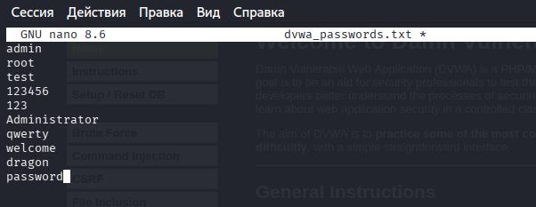
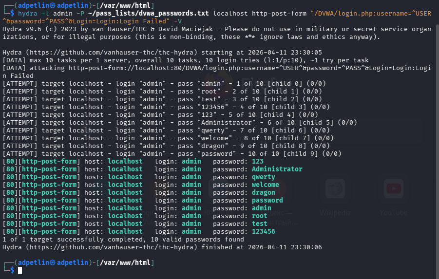
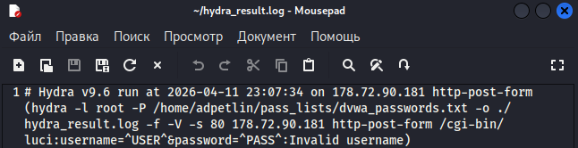

---
## Author
author:
  name: Артём Дмитриевич Петлин
  degrees: Student
  orcid: 0000-0002-0877-7063
  email: 1132246846@pfur.ru
  affiliation:
    - name: Российский университет дружбы народов
      country: Российская Федерация
      postal-code: 117198
      city: Москва
      address: ул. Миклухо-Маклая, д. 6
## Title
title: Индивидуальный проект. Этап 3
license: CC BY
date: today	
date-format: "YYYY-MM-DD" # Example: 2025-09-06
---

# Информация

## Докладчик

:::::::::::::: {.columns align=center}
::: {.column width="70%"}

  * Петлин Артём Дмитриевич
  * студент
  * группа НПИбд-02-24
  * Российский университет дружбы народов
  * [1132246846@pfur.ru](mailto:1132246846@pfur.ru)
  * <https://github.com/hikrim/study_2025-2026_infosec-intro>

:::
::: {.column width="30%"}

:::
::::::::::::::

# Цель работы

## Цель работы

Протестировать hydra в Kali Linux.

# Задание

## Задание

Протестировать hydra в Kali Linux.

# Теоретическое введение

## Теоретическое введение

 
- Hydra используется для подбора или взлома имени пользователя и пароля.
- Поддерживает подбор для большого набора приложений.

# Выполнение лабораторной работы

## Ход работы

:::::::::::::: {.columns align=center}
::: {.column width="25%"}

Создаем словари.

:::
::: {.column width="25%"}

{#fig-001 width=100%}

:::
::: {.column width="25%"}

{#fig-002 width=100%}

:::
::: {.column width="25%"}

{#fig-003 width=100%}

:::
::::::::::::::

## Ход работы

{#fig-004 width=100%}

Попытка тестирования hydra на dvwa

## Ход работы

{#fig-005 width=100%}

Попытка по ip из задания

# Выводы

## Выводы

Мы протестировали hydra в Kali Linux.

# Список литературы{.unnumbered}

## Список литературы{.unnumbered}

::: {#refs}
:::
