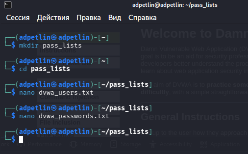
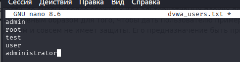

---
## Author
author:
  name: Артём Дмитриевич Петлин
  degrees: student
  orcid: 0000-0002-0877-7063
  email: kulyabov-ds@rudn.ru
  affiliation:
    - name: Российский университет дружбы народов
      country: Российская Федерация
      postal-code: 117198
      city: Москва
      address: ул. Миклухо-Маклая, д. 6

## Title
title: "Индивидуальный проект. Этап 3"
license: "CC BY"
---

# Цель работы

Протестировать hydra в Kali Linux.

# Задание

Протестировать hydra в Kali Linux.

# Теоретическое введение

 
- Hydra используется для подбора или взлома имени пользователя и пароля.
- Поддерживает подбор для большого набора приложений.

# Выполнение лабораторной работы

{#fig-001 width=100%}

{#fig-002 width=100%}

{#fig-003 width=100%}

Создаем словари.

{#fig-004 width=100%}

Попытка тестирования hydra на dvwa

{#fig-005 width=100%}

Попытка по ip из задания

# Выводы

Мы протестировали hydra в Kali Linux.

# Список литературы{.unnumbered}

::: {#refs}
:::
