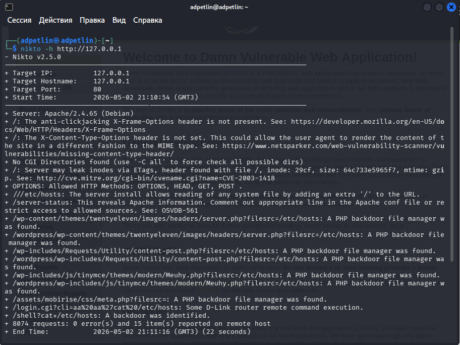
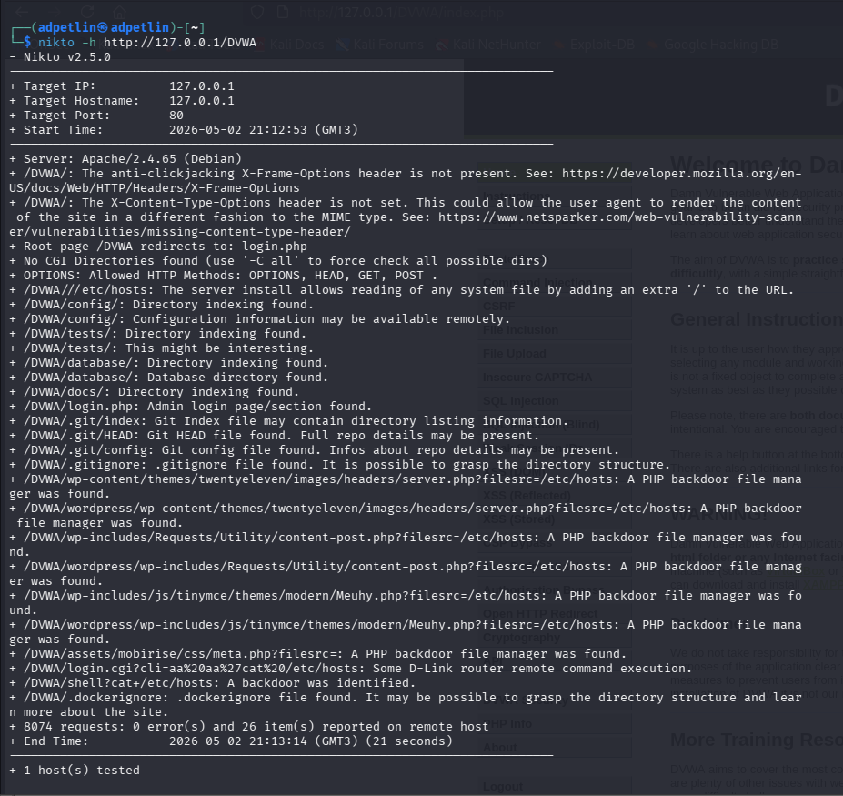

---
## Author
author:
  name: Артём Дмитриевич Петлин
  degrees: student
  orcid: 0000-0002-0877-7063
  email: kulyabov-ds@rudn.ru
  affiliation:
    - name: Российский университет дружбы народов
      country: Российская Федерация
      postal-code: 117198
      city: Москва
      address: ул. Миклухо-Маклая, д. 6

## Title
title: "Индивидуальный проект. Этап 4"
license: "CC BY"
---

# Цель работы

Проведение автоматизированного сканирования веб-сервера на наличие известных уязвимостей, ошибок конфигурации и потенциально опасных файлов.

# Задание

- Найти максимальное количество уязвимостей различных типов.
- Реализовать успешную эксплуатацию каждой уязвимости.

# Теоретическое введение

- Ищутся уязвимости в специально предназначенном для этого веб приложении под названием Damn Vulnerable Web Application (DVWA).
- Назначение DVWA — попрактиковаться в некоторых самых распространённых веб уязвимостях.
- Предлагается попробовать и обнаружить так много уязвимостей, как сможете.

# Выполнение лабораторной работы

{#fig-001 width=100%}

Nikto показывает:  

- Информация о сервере
- Отсутствующие заголовки безопасности, такие как X-Frame-Options, X-Content-Type-Options.
- /server-status — раскрыта информация о статусе Apache (OSVDB-561)
- /etc/hosts — возможна читка системных файлов через добавление '/'
- Найдены PHP backdoor файлы в директориях WordPress
- /shell?cat+/etc/hosts — идентифицирован бэкдор
- /login.cgi — уязвимость D-Link router (CVE-2003-1418)

{#fig-002 width=100%}

Сканирование DVWA приложения:  

- /DVWA/config/ — найдена директория конфигурации
- /DVWA/tests/ — тестовые файлы доступны
- /DVWA/database/ — директория БД открыта
- /DVWA/docs/ — документация доступна  

- .git/index — возможно получение полной истории репозитория
- .git/config — информация о настройках Git
- .gitignore — раскрыта структура директорий
- .dockerignore — информация о Docker-конфигурации  

- Те же backdoor файлы что и в первом сканировании
- /DVWA/login.php — страница администратора найдена

# Выводы

Мы провели автоматизированное сканирование веб-сервера на наличие известных уязвимостей, ошибок конфигурации и потенциально опасных файлов.

# Список литературы{.unnumbered}

::: {.refs}
1. Парасрам, Ш. Kali Linux: Тестирование на проникновение и безопасность : Для профессионалов. Kali Linux / Ш. Парасрам, А. Замм, Т. Хериянто, и др. – Санкт-Петербург : Питер, 2022. – 448 сс.
:::
